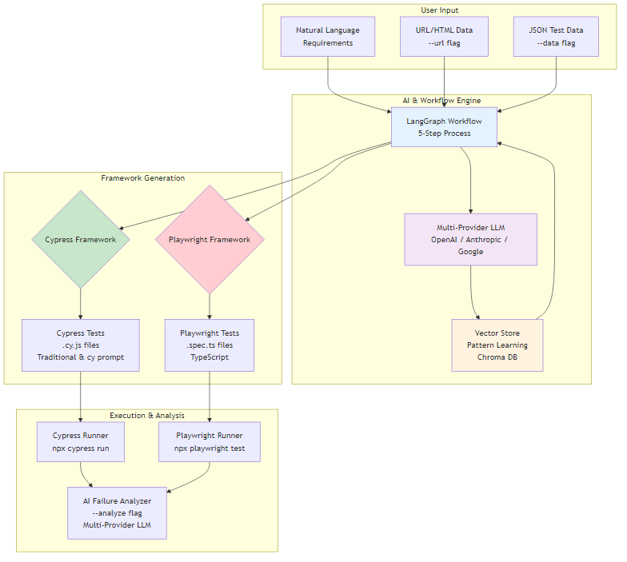
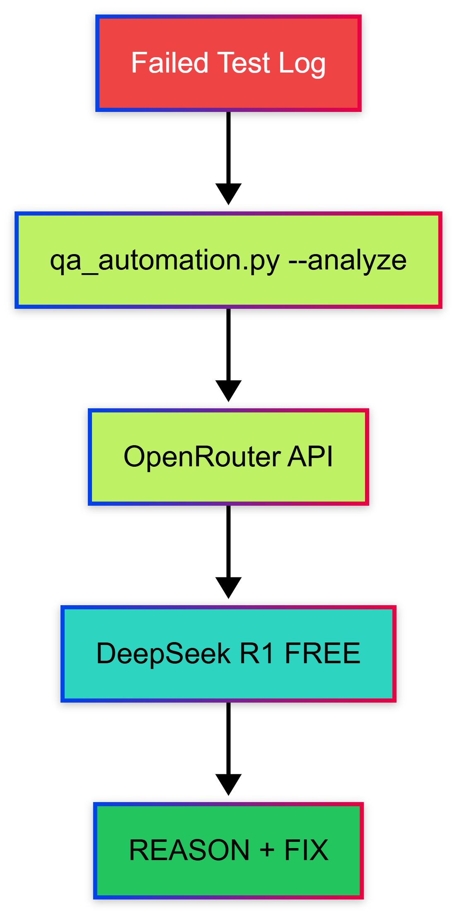
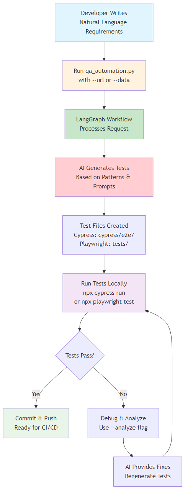
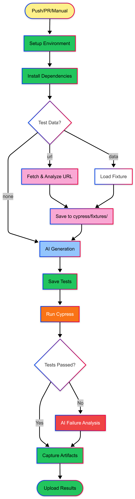
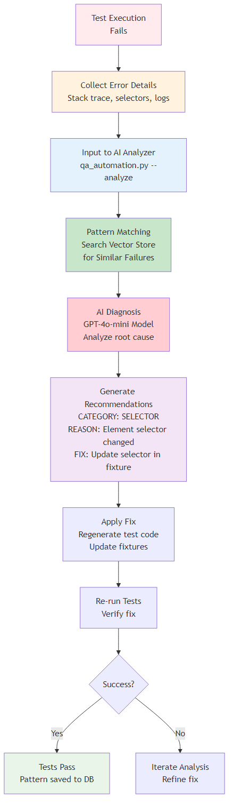

# Cypress Test Generation Framework - Natural Language to E2E Tests

An AI-powered tool that generates Cypress end-to-end tests from natural language requirements using OpenAI and LangGraph workflows.

## Visual Workflow

### Complete End-to-End Process

<p align="center">
  
</p>

This framework transforms natural language requirements into production-ready Cypress tests using AI. It works seamlessly in both **local development** and **CI/CD environments**.

---

## System Architecture

<p align="center">
  
</p>

---

## cy.prompt() Integration

This framework supports **two test generation modes**:

### Traditional Cypress Tests
```bash
python qa_automation.py "Test login functionality" --url https://example.com/login
```
- Fast execution
- Explicit selectors
- Deterministic
- No runtime AI calls
- Uses fixture data from URL analysis

### Self-Healing Tests (cy.prompt)
```bash
python qa_automation.py "Test login functionality" --use-prompt
```
- Auto-adapting selectors
- Natural language steps
- Self-healing when UI changes
- Visible in Command Log

---

## Test Data Options

The framework provides two ways to supply test data:

### Option 1: Live URL Analysis (--url)

Automatically fetch and analyze any URL to generate test data:

```bash
python qa_automation.py "Test login" --url https://the-internet.herokuapp.com/login
```

This will:
1. Fetch the URL and analyze the HTML
2. Extract real selectors (#id, .class, [name=x])
3. Generate test cases (valid_test + invalid_test)
4. Save fixture to `cypress/fixtures/url_test_data.json`
5. Generate tests using the extracted data

### Option 2: JSON Test Data (--data)

Use an existing JSON file with test data:

```bash
python qa_automation.py "Test login" --data cypress/fixtures/login_data.json
```

**JSON Structure:**
```json
{
  "url": "https://the-internet.herokuapp.com/login",
  "selectors": {
    "username": "#username",
    "password": "#password",
    "submit": "button[type=\"submit\"]"
  },
  "test_cases": [
    {
      "name": "valid_test",
      "username": "tomsmith",
      "password": "SuperSecretPassword!",
      "expected": "success"
    },
    {
      "name": "invalid_test",
      "username": "invaliduser",
      "password": "wrongpassword",
      "expected": "error"
    }
  ]
}
```

---

## AI Failure Analyzer

Analyze test failures instantly using **FREE LLM** via OpenRouter!

### How It Works

<p align="center">
  
</p>

### Usage

```bash
# Direct error message
python qa_automation.py --analyze "CypressError: Timed out retrying: Expected to find element: #submit-btn"

# From log file
python qa_automation.py --analyze -f cypress/logs/error.log

# Pipe from stdin
cat error.log | python qa_automation.py --analyze
```

### Example Output

```
Analyzing...

REASON: Element #submit-btn not found - selector changed or page not fully loaded
FIX: Use cy.get('[data-testid="submit"]') or add cy.wait() before clicking
```

### Why Use It?

| Feature | Benefit |
|---------|---------|
| **FREE** | Uses OpenRouter's free DeepSeek R1 model |
| **Fast** | Get answers in seconds |
| **Actionable** | Returns specific REASON + FIX |
| **Simple** | One command, instant results |

---

## Features

* **AI-Powered**: Converts natural language requirements into working Cypress tests
* **AI Failure Analyzer**: Instantly diagnose test failures with FREE LLM
* **Dual Mode**: Traditional tests OR self-healing cy.prompt() tests
* **URL Analysis**: Automatically fetch and analyze live URLs to generate test data and selectors
* **JSON Data Support**: Use existing test data files for consistent test generation
* **Document Context**: Optional vector store integration for additional context from documentation
* **Workflow Management**: Uses LangGraph for structured test generation pipeline
* **Auto-Run**: Optionally runs generated tests immediately with Cypress
* **Organized Output**: Generates timestamped, descriptively named test files in separate directories

## Prerequisites

* **Node.js** (v14 or higher)
* **Python** (v3.8 or higher)
* **OpenAI API Key**
* **OpenRouter API Key** (for failure analysis)
* **Cypress** (v15.8.1 for cy.prompt support)

## Installation

### 1. Clone and Setup Python Environment

```bash
git clone https://github.com/aiqualitylab/cypress-natural-language-tests.git
cd cypress-natural-language-tests
python -m venv venv
source venv/bin/activate  # On Windows: venv\Scripts\activate
```

### 2. Install Python Dependencies

```bash
pip install -r requirements.txt
```

The `requirements.txt` includes:

```
langgraph
langchain-openai
langchain-community
langchain
chromadb
python-dotenv
requests
```

### 3. Setup Environment Variables

Create a `.env` file in the project root:

```bash
OPENAI_API_KEY=your_openai_api_key_here
OPENROUTER_API_KEY=your_openrouter_api_key_here
```

> Get your FREE OpenRouter API key at [openrouter.ai](https://openrouter.ai)

### 4. Initialize Cypress

```bash
npm install cypress@15.8.1 --save-dev
npx cypress open  # Initial setup
```

## Usage

### Basic Usage

Generate Cypress tests from natural language requirements:

```bash
# Traditional tests with URL analysis
python qa_automation.py "Test user login with valid credentials" --url https://example.com/login

# Traditional tests with JSON data
python qa_automation.py "Test user login" --data cypress/fixtures/login_data.json

# Self-healing tests with cy.prompt()
python qa_automation.py "Test user login with valid credentials" --use-prompt
```

### Analyze Test Failures

```bash
# Analyze error directly
python qa_automation.py --analyze "CypressError: Element not found"

# Analyze from log file
python qa_automation.py --analyze -f error.log
```

### Command Line Arguments

| Argument | Description | Default |
| --- | --- | --- |
| `requirements` | One or more test requirements (positional) | Required |
| `--url`, `-u` | Live URL to fetch and generate test data | `None` |
| `--data`, `-d` | JSON file with test data | `None` |
| `--out` | Output directory for generated specs | `cypress/e2e` |
| `--use-prompt` | Generate self-healing tests with cy.prompt() | `false` |
| `--run` | Run Cypress tests after generation | `false` |
| `--docs` | Directory with additional context documents | `None` |
| `--analyze`, `-a` | Analyze test failure | - |
| `--file`, `-f` | Log file to analyze | - |

---

## Examples

### 1. Basic Test Generation with URL Analysis

```bash
python qa_automation.py "Test login page" --url https://the-internet.herokuapp.com/login
```

**Output**: 
- `cypress/fixtures/url_test_data.json` (auto-generated test data)
- `cypress/e2e/generated/01_test-login-page_20241223_100000.cy.js`

### 2. Test Generation with JSON Data

```bash
python qa_automation.py "Test login page" --data cypress/fixtures/login_data.json
```

**Output**: `cypress/e2e/generated/01_test-login-page_20241223_100000.cy.js`

### 3. Self-Healing Test with cy.prompt()

```bash
python qa_automation.py "Test login page" --use-prompt
```

**Output**: `cypress/e2e/prompt-powered/01_test-login-page_20241223_100000.cy.js`

### 4. Multiple Requirements with URL Analysis

```bash
python qa_automation.py \
  "Test successful login with valid credentials" \
  "Test login failure with invalid password" \
  "Test login form validation for empty fields" \
  --url https://the-internet.herokuapp.com/login
```

### 5. With Documentation Context

```bash
python qa_automation.py \
  "Test the checkout process" \
  --docs ./api-docs \
  --url https://example.com/checkout
```

### 6. Generate and Run Tests

```bash
python qa_automation.py \
  "Test user profile update" \
  --url https://example.com/profile \
  --run
```

### 7. Analyze Failed Test

```bash
python qa_automation.py --analyze "AssertionError: expected true to equal false"
```

---

## Output Structure

Tests and fixtures are organized by type:

```
cypress/
├── e2e/
│   ├── generated/              # Traditional Cypress tests
│   │   ├── 01_test-login_20241223_100000.cy.js
│   │   └── 02_test-signup_20241223_100001.cy.js
│   └── prompt-powered/         # cy.prompt() self-healing tests
│       ├── 01_test-checkout_20241223_100000.cy.js
│       └── 02_test-cart_20241223_100001.cy.js
└── fixtures/
    └── url_test_data.json      # Auto-generated from --url
```

---

## How It Works

### Option 1: Local Development

<p align="center">
  
</p>

### Option 2: CI/CD Pipeline

<p align="center">
  
</p>

### Option 3: AI Failure Analysis

<p align="center">
  
</p>


---

## Test Comparison

### Traditional Cypress Test (with fixtures)
```javascript
// cypress/e2e/generated/01_test-login_*.cy.js
describe('Login Tests', function () {
    beforeEach(function () {
        cy.fixture('url_test_data').then((data) => {
            this.testData = data;
        });
    });

    it('should login successfully with valid credentials', function () {
        cy.visit(this.testData.url);
        const valid = this.testData.test_cases.find(tc => tc.name === 'valid_test');
        cy.get('#username').type(valid.username);
        cy.get('#password').type(valid.password);
        cy.get('button[type="submit"]').click();
        cy.url().should('include', '/secure');
    });

    it('should show error with invalid credentials', function () {
        cy.visit(this.testData.url);
        const invalid = this.testData.test_cases.find(tc => tc.name === 'invalid_test');
        cy.get('#username').type(invalid.username);
        cy.get('#password').type(invalid.password);
        cy.get('button[type="submit"]').click();
        cy.get('#flash').should('contain', 'invalid');
    });
});
```

### cy.prompt() Self-Healing Test
```javascript
// cypress/e2e/prompt-powered/01_test-login_*.cy.js
describe('User Login Tests', () => {
    const baseUrl = 'https://the-internet.herokuapp.com/login';

    beforeEach(() => {
        cy.visit(baseUrl);
    });

    it('should successfully log in with valid credentials', () => {
        cy.get('input[type="text"]').type('tomsmith');
        cy.get('input[type="password"]').type('SuperSecretPassword!');
        cy.get('button[type="submit"]').click();

        cy.url().should('include', '/secure');
        cy.get('.flash.success').should('be.visible').and('contain', 'You logged into a secure area!');
    });
});
```

---

## When to Use Each Mode

| Scenario | Use This |
|----------|----------|
| Stable application | Traditional + --url |
| Active development | cy.prompt() |
| CI/CD pipeline | Traditional + --data |
| Exploratory testing | cy.prompt() |
| Regression suite | Traditional + --data |
| Rapid prototyping | cy.prompt() |
| New application | Traditional + --url |
| **Test failed?** | **--analyze** |

---

## Configuration

### Cypress Configuration

The `cypress.config.js` enables cy.prompt():

```javascript
module.exports = defineConfig({
  e2e: {
    experimentalCypressPrompt: true,  // Enable cy.prompt()
    baseUrl: 'https://the-internet.herokuapp.com',
  }
});
```

### LLM Configuration

The framework uses these models:
- **Test Generation**: OpenAI `gpt-4o-mini` (temperature=0)
- **Failure Analysis**: OpenRouter `deepseek/deepseek-r1-0528:free`

---

## Running Tests

### Run All Tests
```bash
npm test
```

### Run Only cy.prompt() Tests
```bash
npm run cypress:run -- --spec "cypress/e2e/prompt-powered/**/*.cy.js"
```

### Run Only Traditional Tests
```bash
npm run cypress:run -- --spec "cypress/e2e/generated/**/*.cy.js"
```

### Open Cypress UI
```bash
npx cypress open
```

---

## File Naming Convention

Generated files follow this pattern:

```
{sequence}_{slugified-requirement}_{timestamp}.cy.js
```

Example: `01_test-user-login_20241223_100000.cy.js`

---

## Vector Store Integration

When using `--docs`, the tool:

1. Indexes all documents in the specified directory
2. Creates/updates a Chroma vector store in `./vector_store`
3. Uses document context to improve test generation accuracy

**Supported document formats**: `.txt`, `.md`, `.json`

---

## Workflow Architecture

The tool uses LangGraph to orchestrate the following steps:

1. **parse_cli_node** - Parse command line arguments
2. **load_context_node** - Index documentation (if provided)
3. **generate_tests_node** - Create Cypress tests using AI (traditional or cy.prompt)
4. **run_cypress_node** - Execute tests (if requested)

The `--analyze` mode bypasses the workflow and directly calls OpenRouter for instant failure analysis.

---

## Command Reference

| Command | Description |
|---------|-------------|
| `python qa_automation.py "Test X" --url URL` | Generate with live URL analysis |
| `python qa_automation.py "Test X" --data file.json` | Generate with JSON test data |
| `python qa_automation.py "Test X" --use-prompt` | Generate self-healing test |
| `python qa_automation.py "Test X" --run` | Generate and run |
| `python qa_automation.py "Test X" --docs ./docs` | Use documentation context |
| `python qa_automation.py --analyze "error"` | Analyze failure |
| `python qa_automation.py --analyze -f log.txt` | Analyze from file |

---

## GitHub Copilot Integration

This repository includes GitHub Copilot instructions and skills to help you work more efficiently with AI assistance.

### Available Copilot Skills

- **Cypress AI Test Generation**: Specialized knowledge for working with the test generation pipeline
- **LangGraph Workflow Development**: Comprehensive guide for building and debugging workflows

---

## Contributing

Contributions are welcome! Please feel free to submit a Pull Request.

---

## License

[](https://www.gnu.org/licenses/agpl-3.0)


---

## Related Projects

Check out more AI-powered testing projects at [@aiqualitylab](https://github.com/aiqualitylab)

---

## About

This project generates Cypress E2E tests automatically from natural language requirements using OpenAI GPT, LangChain, and LangGraph. Now with cy.prompt() support for self-healing test capabilities!

**Author**: [@aiqualitylab](https://github.com/aiqualitylab)  
**Medium**: [AQE Publication](https://medium.com/ai-in-quality-assurance) / [Let's Automate Medium](https://aiqualityengineer.com/)

---

## What's New in v2.1

- **AI Failure Analyzer**: Instantly diagnose test failures with FREE LLM
- **OpenRouter Integration**: Uses DeepSeek R1 (FREE) for failure analysis
- **URL Analysis**: `--url` flag to auto-generate test data from live pages
- **JSON Data Support**: `--data` flag to use existing test data files
- **Fixture Pattern**: Traditional tests now use `cy.fixture()` with `this.testData`

## What's New in v2.0

- **cy.prompt() Integration**: Self-healing test support
- **Dual Mode Generation**: Choose traditional or cy.prompt tests
- **Organized Output**: Separate folders for different test types
- **Simplified Code**: Clean, maintainable implementation
- **Enhanced CLI**: New `--use-prompt` flag

---

**And this is just the beginning!** More features are planned to take this framework to the next level.

Star and Fork this repo to stay updated!

Follow my Medium profile for feature announcements, tutorials, and behind-the-scenes updates: [Let's Automate Medium](https://aiqualityengineer.com/) / [AQE Publication](https://medium.com/ai-in-quality-assurance)

**Happy Testing!**