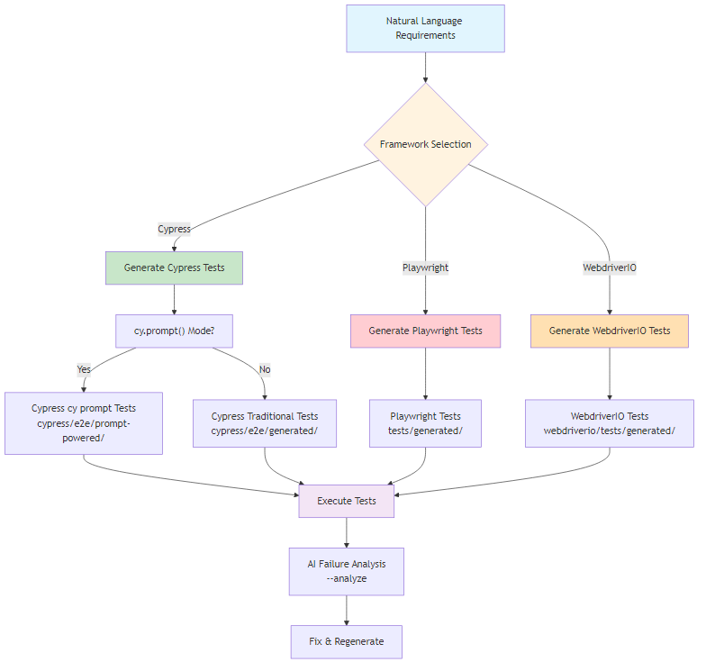
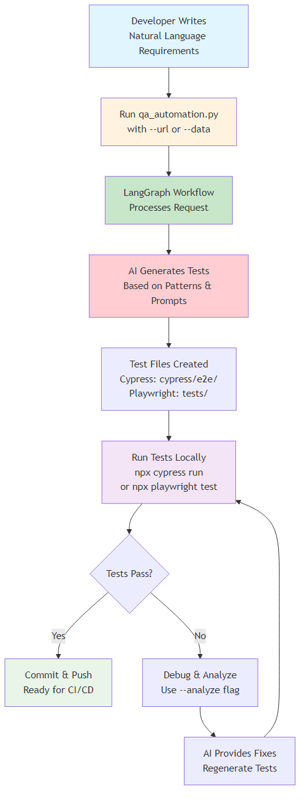
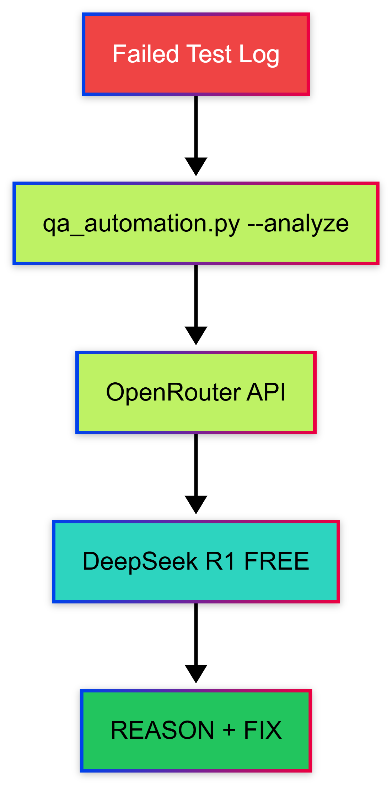
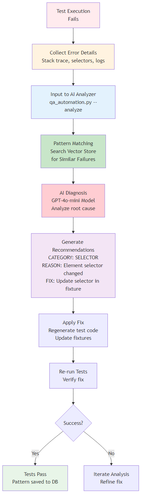

# AI-Powered E2E Test Generation from Natural Language

An AI-powered tool that generates **Cypress** and **Playwright** end-to-end tests from natural language requirements using OpenAI's GPT-4, LangChain, LangGraph workflows, and vector store pattern learning.

[](https://github.com/aiqualitylab/ai-natural-language-tests/actions/workflows/ci.yml)

## Workflow Overview

<p align="center">
  
</p>

Supports local development and CI/CD pipelines.

---

## Architecture

<p align="center">
  
</p>

---

## New in v3.3 — Multi-Provider LLM Support

- 🤖 **3 LLM Providers**: OpenAI (ChatGPT), Anthropic (Claude), Google (Gemini)
- ⚡ **ChatGPT Default**: No flag needed, uses `gpt-4o-mini` by default
- 🔄 **Graceful Fallback**: Missing providers automatically fall back to OpenAI
- 🆕 **Simple CLI**: Just add `--llm openai|anthropic|google`
- 📦 **Optional Packages**: Install only providers you need

## New in v3.2 — Docker Support

- 🐳 **Docker Compose**: Single command to build and run — no local Python or Node.js needed
- 📦 **Tagged Images**: `docker compose build` creates `ai-natural-language-tests:v3.2`
- 🔒 **Secrets Safe**: API keys injected at runtime, never baked into the image
- 💾 **Persistent Patterns**: Vector store mounted as volume, patterns survive across runs

## New in v3.1 — Playwright Support

- 🎭 **Multi-Framework**: Generate tests for Cypress (JavaScript) or Playwright (TypeScript) with `--framework`
- 🧠 **Smart Prompt**: Playwright prompt covers all Playwright methods — locators, actions, assertions, network interception, dialogs, multi-tab, and more
- 🔒 **Cypress Unchanged**: Default is still `cypress`. All existing commands work as before
- ⚠️ **cy.prompt() is Cypress-only**: `--use-prompt` is ignored with a warning when used with `--framework playwright`

### Framework Comparison

| | Cypress | Playwright |
|---|---|---|
| Language | JavaScript (`.cy.js`) | TypeScript (`.spec.ts`) |
| Output directory | `cypress/e2e/generated/` | `tests/generated/` |
| cy.prompt() support | ✅ Yes | ❌ No |
| Run command | `npx cypress run` | `npx playwright test` |
| Prompt file | `test_generation_traditional.txt` | `test_generation_playwright.txt` |

---

### LangGraph Workflow

<p align="center">
  
</p>

Five workflow steps:
1. Initialize Vector Store - Create pattern database
2. Fetch Test Data - Pull HTML and extract selectors  
3. Search Similar Patterns - Query past test patterns
4. Generate Tests - Build test with AI and patterns
5. Run Tests - Execute via Cypress or Playwright (optional)

### Pattern Learning

- Saves test patterns to vector database
- Finds similar patterns from history
- Applies past patterns during generation
- Builds pattern library over time

---

## Example Flow

### Initial Test
```bash
python qa_automation.py "Test login" --url https://the-internet.herokuapp.com/login
```
Steps:
1. Create vector store
2. Fetch page HTML
3. No patterns available
4. Generate fresh test
5. Save pattern

### Using Patterns
```bash
python qa_automation.py "Test user authentication" --url https://the-internet.herokuapp.com/login
```
Steps:
1. Load vector store
2. Fetch page HTML
3. Find matching patterns
4. Generate test with pattern context
5. Save new pattern

---

## Development Flow

<p align="center">
  
</p>

---

## Failure Analysis

<p align="center">
  
</p>

```bash
# Direct analysis
python qa_automation.py --analyze "CypressError: Element not found"

# From log file
python qa_automation.py --analyze -f error.log
```

<p align="center">
  
</p>

---

## CI/CD Integration

<p align="center">
  
</p>

---

## Capabilities

- LangGraph workflow engine
- Vector-based pattern storage
- Semantic pattern matching
- Natural language to test code
- URL-based test generation
- AI-powered failure diagnosis with 3 LLM providers
- Traditional and cy.prompt() modes (Cypress)
- Playwright TypeScript test generation
- Multi-framework support via `FRAMEWORK_CONFIG`
- Pattern library management
- **Multi-provider LLM support**: OpenAI, Anthropic, Google
- Docker support for zero-install usage

---

## Setup

### Local Setup

```bash
git clone https://github.com/aiqualitylab/ai-natural-language-tests.git
cd ai-natural-language-tests

pip install -r requirements.txt

echo "OPENAI_API_KEY=sk-your-key" > .env

npm install cypress@15.8.1 --save-dev

# Playwright (optional)
npm install --save-dev @playwright/test
npx playwright install chromium
```

### Docker Setup

No local Python or Node.js required — only [Docker](https://docs.docker.com/get-docker/) (Docker Compose is included with Docker Desktop).

**Step 1** — Clone and create `.env`

```bash
git clone https://github.com/aiqualitylab/ai-natural-language-tests.git
cd ai-natural-language-tests
echo "OPENAI_API_KEY=sk-your-key" > .env
```

**Step 2** — Build the image

```bash
docker compose build
```

**Step 3** — Generate tests

```bash
# Cypress test (default)
docker compose run --rm test-generator \
  "Test login" --url https://the-internet.herokuapp.com/login

# Playwright test
docker compose run --rm test-generator \
  "Test login" --url https://the-internet.herokuapp.com/login --framework playwright

# cy.prompt() test (Cypress only)
docker compose run --rm test-generator \
  "Test login" --url https://the-internet.herokuapp.com/login --use-prompt

# Multiple requirements
docker compose run --rm test-generator \
  "Test successful login with valid credentials" \
  "Test login failure with invalid password" \
  "Test login form validation for empty fields" \
  --url https://the-internet.herokuapp.com/login --framework playwright

# Failure analysis
docker compose run --rm test-generator \
  --analyze "CypressError: Element not found"

# List stored patterns
docker compose run --rm test-generator --list-patterns
```

Generated tests appear in the same output directories as local setup. Pattern learning persists across runs via volume mounts.

| Volume Mount                  | Purpose                              |
|-------------------------------|--------------------------------------|
| `cypress/e2e/generated/`     | Generated Cypress standard tests      |
| `cypress/e2e/prompt-powered/`| Generated cy.prompt() tests           |
| `tests/generated/`           | Generated Playwright tests            |
| `vector_db/`                 | ChromaDB pattern store persists here  |

---

## Environment Variables

```bash
# Required (default provider)
OPENAI_API_KEY=your_key

# Optional (for Anthropic)
ANTHROPIC_API_KEY=your_key

# Optional (for Google)
GOOGLE_API_KEY=your_key
```

---

## Commands

### Basic Generation (ChatGPT Default)
```bash
python qa_automation.py "Test login" --url https://the-internet.herokuapp.com/login
```

### Multi-Provider LLM Support
```bash
# Use Claude (Anthropic)
python qa_automation.py "Test login" --url https://the-internet.herokuapp.com/login --llm anthropic

# Use Gemini (Google)
python qa_automation.py "Test login" --url https://the-internet.herokuapp.com/login --llm google

# View available providers
python qa_automation.py --help
```

### cy.prompt() Mode
```bash
python qa_automation.py "Test login" --url https://the-internet.herokuapp.com/login --use-prompt
```
### Playwright — Standard Generation
```bash
python qa_automation.py "Test login" --url https://the-internet.herokuapp.com/login --framework playwright
```

### Multiple Requirements — Playwright
```bash
python qa_automation.py \
  "Test successful login with valid credentials" \
  "Test login failure with invalid password" \
  "Test login form validation for empty fields" \
  --url https://the-internet.herokuapp.com/login \
  --framework playwright
```

### Generate and Execute
```bash
# Cypress
python qa_automation.py "Test login" --url https://the-internet.herokuapp.com/login --run

# Playwright
python qa_automation.py "Test login" --url https://the-internet.herokuapp.com/login --framework playwright --run
```

### Execution Videos

- Cypress terminal execution recording: `.github/images/Cypress_execution.mp4`
- Playwright terminal execution recording: `.github/images/Playwright_execution.mp4`

### View Patterns
```bash
python qa_automation.py --list-patterns
```

### Analyze Errors
```bash
python qa_automation.py --analyze "CypressError: Element not found"
```

Returns: `CATEGORY: SELECTOR REASON: ... FIX: ...` (via OpenAI GPT-4o-mini)

### Command Line Arguments

| Argument | Description | Default |
|---|---|---|
| `requirements` | One or more test requirements (positional) | Required |
| `--framework` | Target framework: `cypress` or `playwright` | `cypress` |
| `--url`, `-u` | URL to analyze for selectors and test data | None |
| `--out` | Output directory for generated specs | Framework default |
| `--use-prompt` | Use cy.prompt() style (Cypress only) | `false` |
| `--run` | Run tests after generation | `false` |
| `--llm` | LLM provider: `openai`, `anthropic`, `google` | `openai` |
| `--analyze`, `-a` | Analyze a test failure log | — |
| `--file`, `-f` | Log file to analyze | — |
| `--list-patterns` | List all stored patterns in vector store | — |

## Running Generated Tests

### Cypress
```bash
# Run all generated tests
npx cypress run --spec 'cypress/e2e/generated/**/*.cy.js'

# Run cy.prompt() tests
npx cypress run --spec 'cypress/e2e/prompt-powered/**/*.cy.js'

# Open Cypress UI
npx cypress open
```

### Playwright
```bash
# Run all generated tests
npx playwright test tests/generated/

# Run with visible browser
npx playwright test --headed

# Run only Chromium
npx playwright test --project=chromium

# View HTML report
npx playwright show-report
```

---

## Directory Structure

```
ai-natural-language-tests/
├── cypress/
│   ├── e2e/
│   │   ├── generated/                        # Standard Cypress tests
│   │   └── prompt-powered/                   # cy.prompt() Cypress tests
│   └── fixtures/
│       └── url_test_data.json
├── tests/
│   └── generated/                            # Playwright tests
├── prompts/
│   ├── html_analysis.txt
│   ├── test_generation_traditional.txt
│   ├── test_generation_prompt_powered.txt
│   └── test_generation_playwright.txt
├── vector_db/                                # Pattern storage
│   └── chroma.sqlite3
├── .env
├── .gitignore
├── .dockerignore                             # NEW in v3.2
├── cypress.config.js
├── docker-compose.yml                        # NEW in v3.2
├── Dockerfile                                # NEW in v3.2
├── playwright.config.ts
├── package.json
├── qa_automation.py
├── requirements.txt
└── README.md
```

---

## File Naming

Pattern:
```
{sequence}_{slugified-requirement}_{timestamp}.{ext}
```

Examples:
```
01_test-login_20250103_142530.cy.js        # Cypress
02_test-signup_20250103_142545.cy.js        # Cypress
01_test-login_20250103_142530.spec.ts       # Playwright
```

Components:
- sequence: 01, 02, 03...
- requirement: URL-safe requirement text
- timestamp: YYYYMMDD_HHMMSS
- `.cy.js` for Cypress, `.spec.ts` for Playwright

---

## Adding a New Framework

Add an entry to `FRAMEWORK_CONFIG` in `qa_automation.py`:

```python
FRAMEWORK_CONFIG = {
    # ... existing entries ...
    "selenium": {
        "name": "Selenium",
        "file_ext": ".test.py",
        "default_output": "selenium_tests",
        "run_cmd": "pytest",
        "code_fence": "python",
        "prompt_file_standard": "test_generation_selenium.txt",
        "supports_prompt_mode": False,
    },
}
```

Then create `prompts/test_generation_selenium.txt`.

---

## Releases

**v3.3** — Multi-provider LLM support (OpenAI, Anthropic, Google)  
**v3.2** — Docker support, docker-compose setup  
**v3.1** — Playwright support, multi-framework architecture  
**v3.0** — LangGraph workflows, vector pattern learning  
**v2.2** — Dynamic test generation  
**v2.1** — AI failure analyzer  
**v2.0** — cy.prompt() support

---
**Medium**: [Let's Automate](https://aiqualityengineer.com/)
