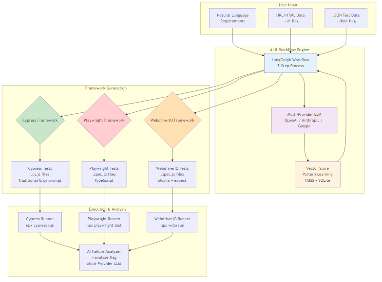
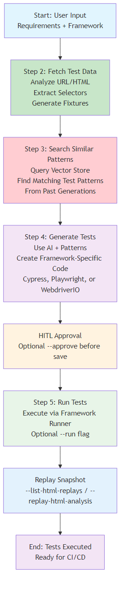
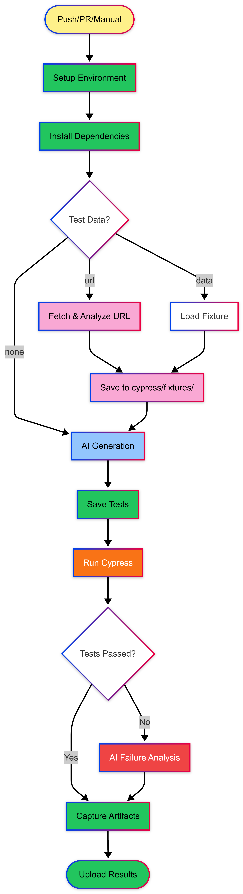

# AI-Powered E2E Test Generation Platform

Enterprise-grade platform to generate and execute Cypress and Playwright end-to-end tests from natural language requirements.

This project combines LLM-driven generation, LangGraph workflow orchestration, and vector-based pattern learning to improve test authoring speed while maintaining repeatability and CI/CD readiness.

[](https://github.com/aiqualitylab/ai-natural-language-tests/actions/workflows/ci.yml)

## Table of Contents

1. Overview
2. Business Value
3. Core Capabilities
4. Architecture
5. Workflow
6. Technology Stack
7. Repository Structure
8. Prerequisites
9. Installation
10. Configuration
11. Usage
12. CI/CD Integration
13. Security and Compliance Guidance
14. Troubleshooting
15. Contributing
16. Change Log Highlights
17. Release History
18. Support

## Overview

The platform translates natural language requirements into executable E2E tests for:

- Cypress (`.cy.js`)
- Playwright (`.spec.ts`)

It supports both local engineering workflows and automated pipeline execution. The generator uses contextual data from live HTML analysis and historical pattern matching to produce stable, maintainable test assets.

## Business Value

- Reduces manual test authoring effort and onboarding time.
- Standardizes generated test structure across teams.
- Improves reuse through vector-based pattern memory.
- Supports enterprise delivery with CI/CD and Docker workflows.
- Enables faster root-cause diagnosis using AI-assisted failure analysis.

## Core Capabilities

- Natural language to executable E2E test generation.
- LangGraph-based multi-step orchestration.
- Dynamic URL analysis and fixture generation.
- Pattern storage and semantic retrieval using ChromaDB.
- Multi-provider LLM support: OpenAI, Anthropic, Google.
- Cypress traditional mode and Cypress prompt-powered mode.
- Playwright TypeScript generation.
- Optional immediate test execution after generation.
- OpenTelemetry trace export to Grafana Tempo.
- Optional log shipping to Grafana Loki.

## Architecture

<p align="center">
  
</p>

### High-Level Components

- CLI interface (`qa_automation.py`)
- LangGraph workflow engine
- LLM provider adapters
- HTML analysis and fixture writer
- Vector store pattern manager
- Test file generation and optional execution
- Observability layer (OpenTelemetry + Loki)

## Workflow

<p align="center">
  
</p>

Generation follows a deterministic five-step flow:

1. Initialize vector store.
2. Fetch and analyze page data (if `--url` is provided).
3. Retrieve similar historical patterns.
4. Generate framework-specific tests.
5. Optionally execute tests (`--run`).

## Technology Stack

- Python CLI orchestration
- LangChain + LangGraph
- ChromaDB vector store
- OpenAI / Anthropic / Google LLM backends
- Cypress and Playwright runners
- OpenTelemetry SDK and OTLP exporter
- Optional Loki logging handler

## Repository Structure

```text
ai-natural-language-tests/
|-- cypress/
|   |-- e2e/
|   |   |-- generated/
|   |   `-- prompt-powered/
|   `-- fixtures/
|-- tests/
|   `-- generated/
|-- prompts/
|-- vector_db/
|-- qa_automation.py
|-- cypress.config.js
|-- playwright.config.ts
|-- package.json
|-- requirements.txt
|-- Dockerfile
|-- docker-compose.yml
`-- README.md
```

## Prerequisites

- Python 3.10+
- Node.js 18+
- npm
- Git
- For Playwright execution: browser runtime (`npx playwright install chromium`)

## Installation

### Local Setup

```bash
git clone https://github.com/aiqualitylab/ai-natural-language-tests.git
cd ai-natural-language-tests
pip install -r requirements.txt
npm ci
npx playwright install chromium
```

Create `.env`:

```bash
OPENAI_API_KEY=your_key
```

### Docker Setup

```bash
git clone https://github.com/aiqualitylab/ai-natural-language-tests.git
cd ai-natural-language-tests
docker compose build
```

Docker Compose loads `.env` and now explicitly forwards observability variables for Tempo and Loki to the container runtime.

Run in container:

```bash
docker compose run --rm test-generator "Test login" --url https://the-internet.herokuapp.com/login
```

Run with observability enabled:

```bash
docker compose run --rm test-generator \
  "Test login" --url https://the-internet.herokuapp.com/login --framework playwright --run
```

## Configuration

### Core API Keys

```bash
OPENAI_API_KEY=your_key
ANTHROPIC_API_KEY=your_key
GOOGLE_API_KEY=your_key
```

### OpenTelemetry (Grafana Tempo)

```bash
OTEL_PROVIDER=grafana
OTEL_EXPORTER_OTLP_ENDPOINT=https://otlp-gateway-prod-eu-north-0.grafana.net/otlp
OTEL_EXPORTER_OTLP_HEADERS=Authorization=Basic <base64(instance_id:api_token)>
```

### Loki Logging (Optional)

```bash
GRAFANA_LOKI_URL=https://logs-prod-eu-north-0.grafana.net
GRAFANA_INSTANCE_ID=<instance_id>
GRAFANA_API_TOKEN=<logs_write_token>
```

## Usage

### Generate Cypress Test

```bash
python qa_automation.py "Test login" --url https://the-internet.herokuapp.com/login
```

### Generate Playwright Test

```bash
python qa_automation.py "Test login" --url https://the-internet.herokuapp.com/login --framework playwright
```

### Prompt-Powered Cypress Mode

```bash
python qa_automation.py "Test login" --url https://the-internet.herokuapp.com/login --use-prompt
```

### Generate and Execute

```bash
python qa_automation.py "Test login" --url https://the-internet.herokuapp.com/login --framework playwright --run
```

### Failure Analysis

```bash
python qa_automation.py --analyze "CypressError: Element not found"
python qa_automation.py --analyze -f error.log
```

### Pattern Inventory

```bash
python qa_automation.py --list-patterns
```

## CI/CD Integration

<p align="center">
  
</p>

Recommended pipeline stages:

1. Install Python and Node dependencies.
2. Validate environment variables and secrets injection.
3. Generate tests from requirements.
4. Execute generated tests.
5. Publish artifacts and reports.
6. Export telemetry to observability stack.

## Security and Compliance Guidance

- Store secrets only in secure secret managers (never commit `.env`).
- Use scoped API tokens with least-privilege access.
- Rotate provider keys and Grafana tokens on a fixed cadence.
- Keep generated tests and reports free of sensitive production data.
- Apply repository protection rules and mandatory CI checks.

## Troubleshooting

### Traces Not Visible in Grafana Tempo

- Verify OTLP endpoint region and datasource selection.
- Verify `Authorization=Basic <base64(instance_id:api_token)>` format.
- Query with:

```traceql
{resource.service.name="ai-natural-language-tests"}
```

### Loki Authentication Errors

- Ensure token has `logs:write` scope.
- Confirm instance ID and logs endpoint match the same Grafana stack.

### Docker Observability Validation

- Confirm `.env` includes OTLP and Loki keys before `docker compose run`.
- Use `docker compose config` to verify environment interpolation.
- In Grafana Explore, query Tempo with `service.name="ai-natural-language-tests"`.
- In Grafana Loki, query labels: `{service_name="ai-natural-language-tests"}`.

## Contributing

Contribution standards, branch conventions, commit format, and review expectations are documented in `CONTRIBUTING.md`.

### Playwright Runtime Issues

- Install required browser runtime.
- Retry with generated single-spec command from logs.

## Change Log Highlights

### v3.5

- Grafana observability updates for both Tempo traces and optional Loki logs.
- Docker Compose now forwards observability environment variables explicitly.
- Enterprise documentation updates, including `CONTRIBUTING.md`.

### v3.4

- Accessible-locator-first HTML analysis.
- Normalized selector schema: `{ cypress, playwright, fallback_css }`.
- Stable test case shape: `test_cases[*].field_name`.
- Resilience backfills for missing selector/test fields.
- Docker fixture persistence improvements.

### v3.3

- Multi-provider LLM support.
- Default OpenAI flow with graceful fallback behavior.

### v3.2

- Docker and Docker Compose support.
- Portable, zero-local-install workflow option.

### v3.1

- Playwright framework support.
- Framework-aware generation architecture.

## Release History

- v3.5: Grafana observability and Docker environment propagation updates
- v3.4: Accessible HTML analysis and normalized fixture schema
- v3.3: Multi-provider LLM support
- v3.2: Docker support
- v3.1: Playwright support
- v3.0: LangGraph workflows and vector pattern learning
- v2.2: Dynamic test generation
- v2.1: AI failure analyzer
- v2.0: Cypress prompt-powered mode

## Support

- Documentation updates and issues: repository Issues tab
- External writing: [Let's Automate](https://aiqualityengineer.com/)
