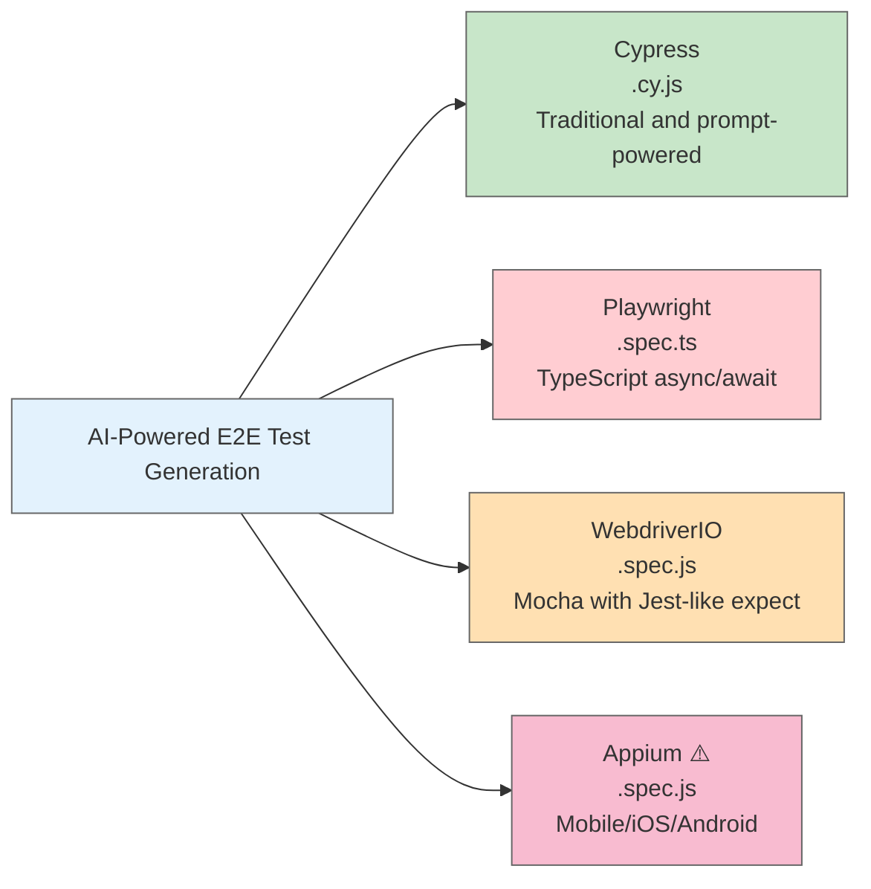
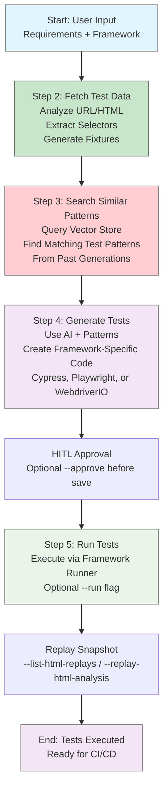
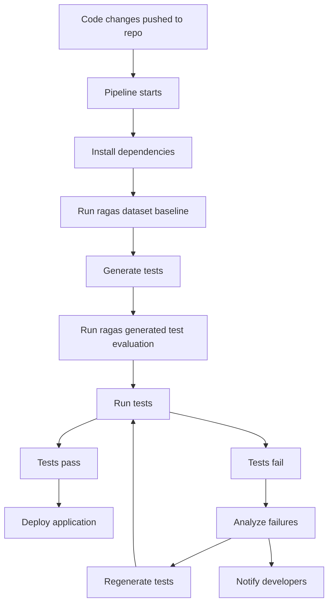

<div align="center">

# AI-Powered E2E Test Generation Platform

> *Translate natural language requirements into production-ready end-to-end tests.*

Enterprise-grade platform to generate and execute Cypress, Playwright, WebdriverIO, and Appium end-to-end tests from natural language requirements. (Appium is experimental and requires external mobile infrastructure.)

This project combines LLM-driven generation, LangGraph workflow orchestration, and vector-based pattern learning to improve test authoring speed while maintaining repeatability and CI/CD readiness.

[](https://github.com/aiqualitylab/ai-natural-language-tests/actions/workflows/ci.yml)

[](https://github.com/aiqualitylab/ai-natural-language-tests/stargazers)

[](https://doi.org/10.5281/zenodo.19535703)


[](https://tests.aiqualitylab.org)

[](https://huggingface.co/spaces/aiqualitylab/ai-natural-language-tests)

</div>

---

## Try It Live

**[ai-natural-language-tests on Hugging Face Spaces](https://huggingface.co/spaces/aiqualitylab/ai-natural-language-tests)** — Try the platform directly in your browser without installation.

---

## Table of Contents

| Section | Links |
|---------|-------|
| Getting Started | [Product Preview](#product-preview)<br/>[Overview](#overview)<br/>[Quick Start (5 Minutes)](#quick-start-5-minutes)<br/>[Business Value](#business-value)<br/>[Core Capabilities](#core-capabilities) |
| Platform Design | [Architecture](#architecture)<br/>[Workflow](#workflow)<br/>[Technology Stack](#technology-stack) |
| Setup and Configuration | [Repository Structure](#repository-structure)<br/>[Prerequisites](#prerequisites)<br/>[Installation](#installation)<br/>[GitHub Registry (GHCR)](#github-registry-ghcr)<br/>[Configuration](#configuration) |
| Using the Platform | [Usage](#usage)<br/>[Test Code Review (AI Judge)](#test-code-review-ai-judge)<br/>[CI/CD Integration](#cicd-integration) |
| Operations | [Security and Compliance Guidance](#security-and-compliance-guidance)<br/>[Troubleshooting](#troubleshooting)<br/>[Compliance and Data Handling](#compliance-and-data-handling)<br/>[Operational Expectations](#operational-expectations)<br/>[Support Matrix](#support-matrix) |
| Project Info | [Documentation Map](#documentation-map)<br/>[Versioning and Release Policy](#versioning-and-release-policy)<br/>[Support and Security Reporting](#support-and-security-reporting)<br/>[Changelog](#changelog) |

## Overview

The platform translates natural language requirements into executable E2E tests for:


```mermaid
flowchart LR
  A[AI-Powered E2E Test Generation]
  A --> C[Cypress<br/>.cy.js<br/>Traditional and prompt-powered]
  A --> P[Playwright<br/>.spec.ts<br/>TypeScript async/await]
  A --> W[WebdriverIO<br/>.spec.js<br/>Mocha with Jest-like expect]
  A --> M["Appium ⚠️<br/>.spec.js<br/>Mobile/iOS/Android"]

  style A fill:#e3f2fd,color:#333333,stroke:#666666
  style C fill:#c8e6c9,color:#333333,stroke:#666666
  style P fill:#ffcdd2,color:#333333,stroke:#666666
  style W fill:#ffe0b2,color:#333333,stroke:#666666
  style M fill:#f8bbd0,color:#333333,stroke:#666666
```

| Framework | Output | Style |
|-----------|--------|-------|
| Cypress | `.cy.js` | Traditional & prompt-powered |
| Playwright | `.spec.ts` | TypeScript async/await |
| WebdriverIO | `.spec.js` | Mocha runner with Jest-like `expect` |
| **Appium** *(Experimental)* | `.spec.js` | Mobile WebdriverIO + async/await |

It supports both local engineering workflows and automated pipeline execution. The generator uses contextual data from live HTML analysis and historical pattern matching to produce stable, maintainable test assets.

## Quick Start (5 Minutes)

```bash
git clone https://github.com/aiqualitylab/ai-natural-language-tests.git
cd ai-natural-language-tests
python -m venv .venv
# Windows PowerShell: .\.venv\Scripts\Activate.ps1
# macOS/Linux: source .venv/bin/activate
pip install -r requirements.txt
npm ci
npx playwright install chromium
```

Create `.env` and set at least one provider key:

```bash
OPENAI_API_KEY=your_key
```

Generate and run one Playwright test:

```bash
python qa_automation.py "Test login with valid credentials" --url https://the-internet.herokuapp.com/login --framework playwright --run
```

## Business Value

> [!NOTE]
> - Reduces manual test authoring effort and onboarding time.
> - Standardizes generated test structure across teams.
> - Improves reuse through vector-based pattern memory.
> - Supports enterprise delivery with CI/CD and Docker workflows.
> - Enables faster root-cause diagnosis using AI-assisted failure analysis.

## Core Capabilities

| Capability | Detail |
|------------|--------|
| Test Generation | Natural language to executable E2E test generation |
| **Conversational Refinement** | Multi-turn natural language refinement of generated tests |
| Orchestration | LangGraph-based multi-step orchestration |
| LangChain Runnables | `RunnableLambda` wrappers for workflow invocation in CLI/UI paths |
| URL Analysis | Dynamic URL analysis and fixture generation |
| Structured Parsing | LangChain `BaseOutputParser` classes for code fences, HTML JSON, and failure output |
| Pattern Memory | Pattern storage and semantic retrieval using FAISS + SQLite |
| Code Review | AI-powered test quality review on four dimensions (assertions, selectors, structure, determinism) with concrete issue detection |
| LLM Support | Multi-provider: OpenAI, Anthropic, Google |
| Cypress Modes | Traditional mode and Cypress prompt-powered mode |
| Playwright | TypeScript generation |
| WebdriverIO | JavaScript `.spec.js` generation with Mocha and Chrome runner support |
| **Appium** *(Experimental)* | JavaScript `.spec.js` generation with WebdriverIO + async/await for Android/iOS |
| HITL | Optional human approval gate with `--approve` |
| Replay | HTML snapshot replay with `--list-html-replays` and `--replay-html-analysis` |
| Execution | Optional immediate test execution after generation |
| Tracing | OpenTelemetry trace export to Grafana Tempo |
| Logging | Optional log shipping to Grafana Loki |

> [!IMPORTANT]
> **Appium Experimental Status:** Appium support is production-ready in code generation but requires:
> - **External Appium Server:** Running separately (e.g., `appium --port 4723`)
> - **Mobile Infrastructure:** Android emulator/device OR iOS simulator/device
> - **Platform SDKs:** Android SDK, Xcode (iOS), or connected devices
> - **Environment Setup:** ANDROID_HOME, platform-tools, emulator
> 
> Test generation works immediately; test *execution* depends on infrastructure availability.

## Architecture


```mermaid
graph TB
    subgraph "User Input"
        A[Natural Language<br/>Requirements]
        B[URL/HTML Data<br/>--url flag]
    C[CLI Requirement Text<br/>one or more prompts]
    end

    subgraph "AI & Workflow Engine"
        D[LangGraph Workflow<br/>5-Step Process]
        E[Multi-Provider LLM<br/>OpenAI / Anthropic / Google]
        F[Vector Store<br/>Pattern Learning<br/>FAISS + SQLite]
    end

    subgraph "Framework Generation"
        G{Cypress Framework}
        H{Playwright Framework}
        W{WebdriverIO Framework}
        I[Cypress Tests<br/>.cy.js files<br/>Traditional & cy.prompt&#40;&#41;]
        J[Playwright Tests<br/>.spec.ts files<br/>TypeScript]
        X[WebdriverIO Tests<br/>.spec.js files<br/>Mocha + expect]
    end

    subgraph "Execution & Analysis"
        K[Cypress Runner<br/>npx cypress run]
        L[Playwright Runner<br/>npx playwright test]
        M[AI Failure Analyzer<br/>--analyze flag<br/>Multi-Provider LLM]
        P[WebdriverIO Runner<br/>npx wdio run]
    end

    A --> D
    B --> D
    C --> D
    D --> E
    E --> F
    F --> D
    D --> G
    D --> H
    D --> W
    G --> I
    H --> J
    W --> X
    I --> K
    J --> L
    X --> P
    K --> M
    L --> M
    P --> M

    style D fill:#e3f2fd,color:#333333,stroke:#666666
    style E fill:#f3e5f5,color:#333333,stroke:#666666
    style F fill:#fff3e0,color:#333333,stroke:#666666
    style G fill:#c8e6c9,color:#333333,stroke:#666666
    style H fill:#ffcdd2,color:#333333,stroke:#666666
    style W fill:#ffe0b2,color:#333333,stroke:#666666
```

<details>
<summary><strong>High-Level Components</strong></summary>

- CLI entrypoint (`qa_automation.py`)
  - Parses arguments, selects mode, and orchestrates actions.
  - Calls workflow `create_workflow()` and handles result output.
- Configuration and prompts (`qa_config.py`)
  - Defines framework metadata, LLM settings, and prompt loading utilities.
  - Handles model provider fallback and YAML template parsing.
- Runtime services (`qa_runtime.py`)
  - Logging/tracing setup (OpenTelemetry, Grafana Loki) and persistent objects.
  - Non-blocking Loki handler with suppressed transient transport tracebacks.
  - FAISS + SQLite pattern store lifecycle and query helpers.
  - HTML analysis replay and parser-backed failure analysis formatting.
- LangGraph workflow (`qa_workflow.py`)
  - Defines `TestState` and step nodes (fetch, pattern search, generate, run).
  - Uses LangChain runnables/parsers for generation input/output shaping.
  - Builds workflow graph with conditional transitions and checkpointer.
- Conversational refinement (`qa_refinement.py`)
  - Multi-turn natural language refinement of generated tests.
  - Panel-based state management: code + instruction → revised code.
  - Safety rules: file integrity, no empty sections, disk-only writes, error recovery.
  - Zero heavy dependencies: imports only from `qa_config` (not `qa_workflow` or `qa_runtime`).
- Observability layer (OpenTelemetry + Loki)

</details>

## Workflow


```mermaid
flowchart TD
    A[Start: User Input<br/>Requirements + Framework] --> C[Step 2: Fetch Test Data<br/>Analyze URL/HTML<br/>Extract Selectors<br/>Generate Fixtures]
    C --> D[Step 3: Search Similar Patterns<br/>Query Vector Store<br/>Find Matching Test Patterns<br/>From Past Generations]
    D --> E[Step 4: Generate Tests<br/>Use AI + Patterns<br/>Create Framework-Specific Code<br/>Cypress, Playwright, or WebdriverIO]
    E --> H[HITL Approval<br/>Optional --approve before save]
    H --> F[Step 5: Run Tests<br/>Execute via Framework Runner<br/>Optional --run flag]
    F --> R[Replay Snapshot<br/>--list-html-replays / --replay-html-analysis]
    R --> G[End: Tests Executed<br/>Ready for CI/CD]

    style A fill:#e1f5fe,color:#333333,stroke:#666666
    style C fill:#c8e6c9,color:#333333,stroke:#666666
    style D fill:#ffcdd2,color:#333333,stroke:#666666
    style E fill:#f3e5f5,color:#333333,stroke:#666666
    style F fill:#e8f5e8,color:#333333,stroke:#666666
    style G fill:#f3e5f5,color:#333333,stroke:#666666
```

Generation follows a deterministic five-step flow:

| Step | Name | Description |
|------|------|-------------|
| 2 | Fetch Test Data | Analyze URL/HTML, extract selectors, generate fixtures |
| 3 | Search Similar Patterns | Query vector store for matching historical patterns |
| 4 | Generate Tests | Use AI + patterns to create framework-specific code, optionally HITL-gated via `--approve` |
| 5 | Run Tests | Optionally execute via framework runner (`--run`) |
| Replay | Debug HTML Analysis | Replay stored HTML snapshots via CLI (`--list-html-replays`, `--replay-html-analysis`) |

## Technology Stack

| Layer | Technology |
|-------|------------|
| Orchestration | Python CLI orchestration |
| Workflow | LangChain + LangGraph |
| Prompt and Output Handling | LangChain PromptTemplate + BaseOutputParser |
| Vector Store | FAISS + SQLite |
| Embeddings | `langchain-huggingface` (preferred) with `langchain-community` fallback |
| LLM Backends | OpenAI / Anthropic / Google |
| Test Runners | Cypress, Playwright, and WebdriverIO runners |
| Observability | OpenTelemetry SDK and OTLP exporter |
| Logging | Loki logging handler (optional) |

## Repository Structure

<details>
<summary>View repository tree</summary>

```text
ai-natural-language-tests/
|-- .github/
|-- docs/
|-- cypress/
|   |-- e2e/
|   |   |-- generated/
|   |   `-- prompt-powered/
|   `-- fixtures/
|-- tests/
|   `-- generated/
|-- webdriverio/
|   `-- tests/
|       `-- generated/
|-- web/
|-- webdriverio/
|   `-- tests/
|       |-- generated/
|       |-- appium-tests/
|       `-- prompt-powered/
|-- prompt_specs/
|-- skills/
|-- services/
|-- knowledge/
|-- generated_exports/
|-- rag_failure_analysis/
|-- vector_db/
|-- qa_automation.py
|-- qa_config.py
|-- qa_runtime.py
|-- qa_workflow.py
|-- qa_refinement.py
|-- test_qa_refinement.py
|-- ragas_evaluator.py
|-- ragas_nlp_evaluator.py
|-- cypress.config.js
|-- playwright.config.ts
|-- wdio.conf.js
|-- package.json
|-- package-lock.json
|-- requirements.txt
|-- Dockerfile
|-- docker-compose.yml
|-- agent.yaml
|-- SOUL.md
|-- RULES.md
|-- PROMPT_UPDATE_GUIDE.md
|-- CONTRIBUTING.md
|-- CHANGELOG.md
`-- README.md
```

</details>

## Prerequisites

| Requirement | Version / Notes |
|-------------|------------------|
| Python | 3.10+ |
| Node.js | 22+ |
| npm | Current stable release |
| Git | Current stable release |
| Playwright browsers | `npx playwright install chromium` |

## Installation

<details>
<summary><strong>Local Setup</strong></summary>

```bash
git clone https://github.com/aiqualitylab/ai-natural-language-tests.git
cd ai-natural-language-tests
python -m venv .venv
# Windows PowerShell: .\.venv\Scripts\Activate.ps1
# macOS/Linux: source .venv/bin/activate
pip install -r requirements.txt
npm ci
npx playwright install chromium
```

Create `.env` from `.env.example`, then set at least one provider key:

```bash
OPENAI_API_KEY=your_key
```

PowerShell quick set for current session:

```powershell
$env:OPENAI_API_KEY = "your_key"
```

</details>

### Optional: GitAgent (Repo-Specific)

This repository includes a targeted gitagent setup for its QA automation workflow:

- `agent.yaml` (manifest)
- `SOUL.md` and `RULES.md` (behavior and constraints)
- `knowledge/` (framework and repo references)

In short: `agent.yaml` defines the repo agent, `SOUL.md` and `RULES.md` define how it should behave, and `knowledge/` gives it project-specific framework guidance.

Quick commands:

```bash
npm run gitagent:validate
npm run gitagent:info
npm run gitagent:export
```

<details>
<summary><strong>Docker Setup</strong></summary>

```bash
git clone https://github.com/aiqualitylab/ai-natural-language-tests.git
cd ai-natural-language-tests
docker compose build
```

Docker Compose loads `.env` and now explicitly forwards observability variables for Tempo and Loki to the container runtime.

Run in container:

```bash
docker compose run --rm test-generator "Test login" --url https://the-internet.herokuapp.com/login
```

Run with observability enabled:

```bash
docker compose run --rm test-generator \
  "Test login" --url https://the-internet.herokuapp.com/login --framework playwright --run
```

</details>

## GitHub Registry (GHCR)

Pre-built Docker images are published to GitHub Container Registry. No local clone or build required.

| Without GHCR | With GHCR |
|---|---|
| Clone → install → build → run | `docker run` — done |
| Each user builds their own image | One image built once, shared everywhere |
| "Works on my machine" problems | Identical environment for every user |

### Pull and run

```bash
docker pull ghcr.io/aiqualitylab/ai-natural-language-tests:latest

docker run --rm \
  -e OPENAI_API_KEY=your_key \
  ghcr.io/aiqualitylab/ai-natural-language-tests:latest \
  "Test login" --url https://the-internet.herokuapp.com/login
```

### Image tags

| Tag | Use case |
|-----|----------|
| `latest` | Always the most recently published version — use for quick runs |
| `v5.1.0` | Pinned to a specific release — use in CI/CD for reproducibility |

For publishing and release management, see [CONTRIBUTING.md](CONTRIBUTING.md).

## Configuration

<details>
<summary><strong>Core API Keys (Cloud Providers)</strong></summary>

```bash
OPENAI_API_KEY=your_key
ANTHROPIC_API_KEY=your_key
GOOGLE_API_KEY=your_key
```

</details>

<details>
<summary><strong>Local LLM Endpoints (Ollama, vLLM, LM Studio)</strong></summary>

Use local LLM endpoints to generate tests **without sending HTML data to cloud APIs**. Supports:
- **Ollama** (run locally: `ollama serve`)
- **vLLM** (high-throughput inference)
- **LM Studio** (simple GUI setup)

**For complete setup, CI/CD workflows, model recommendations, and troubleshooting, see [LOCAL_PROVIDER_GUIDE.md](.github/LOCAL_PROVIDER_GUIDE.md)**

```bash
# Ollama (default: http://localhost:11434/v1)
OLLAMA_BASE_URL=http://localhost:11434/v1
OLLAMA_MODEL=llama2

# OpenAI-compatible endpoint (vLLM, LM Studio)
LOCAL_OPENAI_BASE_URL=http://localhost:8000/v1
LOCAL_OPENAI_MODEL=gpt-3.5-turbo
```

**CLI Usage:**
```bash
python qa_automation.py "Test login" --url https://the-internet.herokuapp.com/login --llm ollama
python qa_automation.py "Test login" --url https://the-internet.herokuapp.com/login --llm local-openai
```

**UI Usage:** Set endpoint URLs in **Settings** tab, then select provider in **Generate Tests** → **LLM Provider** dropdown.

</details>

<details>
<summary><strong>OpenTelemetry (Grafana Tempo)</strong></summary>

```bash
OTEL_PROVIDER=grafana
OTEL_EXPORTER_OTLP_ENDPOINT=https://otlp-gateway-prod-eu-north-0.grafana.net/otlp
OTEL_EXPORTER_OTLP_HEADERS=Authorization=Basic <base64(instance_id:api_token)>
```

</details>

<details>
<summary><strong>Loki Logging (Optional)</strong></summary>

```bash
GRAFANA_LOKI_URL=https://logs-prod-eu-north-0.grafana.net
GRAFANA_INSTANCE_ID=<instance_id>
GRAFANA_API_TOKEN=<logs_write_token>
```

</details>

> [!TIP]
> **Privacy-first setup:**
>
> - Use an LLM provider account/plan that guarantees no training or zero-retention for API data.
> - Keep `OTEL_EXPORTER_OTLP_ENDPOINT`, `OTEL_EXPORTER_OTLP_HEADERS`, `GRAFANA_LOKI_URL`, `GRAFANA_INSTANCE_ID`, and `GRAFANA_API_TOKEN` unset to avoid telemetry/log shipping.
> - Use masked or synthetic test data for sensitive fields.

> [!TIP]
> Need to support a new URL and tune prompts safely?
> Follow the step-by-step guide in [PROMPT_UPDATE_GUIDE.md](PROMPT_UPDATE_GUIDE.md).

## Usage

**Quick Reference**

| Mode | Command |
|------|---------|
| Cypress (default) | `python qa_automation.py "requirement" --url <url>` |
| Playwright | `python qa_automation.py "requirement" --url <url> --framework playwright` |
| WebdriverIO | `python qa_automation.py "requirement" --url <url> --framework webdriverio` |
| **Appium Android** *(Experimental)* | `python qa_automation.py "requirement" --url <url> --framework appium` |
| **Appium iOS** *(Experimental)* | `APP_PLATFORM=ios python qa_automation.py "requirement" --url <url> --framework appium` |
| Prompt-powered Cypress | `python qa_automation.py "requirement" --url <url> --use-prompt` |
| **Appium Prompt-Powered** *(Experimental)* | `python qa_automation.py "requirement" --url <url> --framework appium --use-prompt` |
| Generate + Execute | `python qa_automation.py "requirement" --url <url> --run` |
| Failure Analysis | `python qa_automation.py --analyze "error message"` |
| Pattern Inventory | `python qa_automation.py --list-patterns` |

### Demo & Test URLs

Use these URLs to try the platform immediately:

| App | URL | Best For |
|-----|-----|----------|
| **The Internet** (login form) | `https://the-internet.herokuapp.com/login` | Login tests, form validation, error handling |
| **The Internet** (dynamic loading) | `https://the-internet.herokuapp.com/dynamic_loading/1` | Wait/timing tests, dynamic content |
| **The Internet** (tables) | `https://the-internet.herokuapp.com/tables` | Data extraction, table assertions |
| **The Internet** (file download) | `https://the-internet.herokuapp.com/download` | File handling, downloads |
| **The Internet** (drag & drop) | `https://the-internet.herokuapp.com/drag_and_drop` | Complex interactions |

**Quick test command:**
```bash
python qa_automation.py "Test login with valid credentials" \
  --url https://the-internet.herokuapp.com/login \
  --framework playwright \
  --run
```

> [!TIP]
> If your global `python` misses project dependencies, run with the repository virtual environment:
>
> - PowerShell: `.\.venv\Scripts\python.exe qa_automation.py "Test login" --url https://the-internet.herokuapp.com/login --framework playwright --run`
> - Bash: `./.venv/Scripts/python.exe qa_automation.py "Test login" --url https://the-internet.herokuapp.com/login --framework playwright --run`

> [!NOTE]
> The current CLI supports URL-driven generation via `--url`. A direct `--data` JSON input flag is not implemented in this repository yet.

**Natural Language Prompt Examples**

| What you type | What AI generates |
|---------------|-------------------|
| `"Test login with valid credentials"` | Login form fill + submit + success assertion |
| `"Test login fails with wrong password"` | Negative test with error message assertion |
| `"Test contact form submission"` | Form field detection + submit + confirmation |
| `"Test search returns results"` | Search input + trigger + results count assertion |
| `"Test signup with missing fields"` | Validation error coverage for required fields |
| `"Test logout clears session"` | Post-login logout + redirect assertion |

> [!TIP]
> **Writing effective AI requirements**
>
> - Be specific about the action: *"Test login"* vs *"Test login with valid credentials and verify dashboard loads"*
> - Mention the expected outcome when it matters: *"...and verify error message appears"*
> - Use `--url` to give the AI real page context — it reads the HTML and picks the right selectors automatically
> - Chain multiple requirements in one run: `"Test login" "Test logout" --url <url>`

### Generate Cypress Test

<details>
<summary>Show command</summary>

```bash
python qa_automation.py "Test login" --url https://the-internet.herokuapp.com/login
```

</details>

### Generate Playwright Test

<details>
<summary>Show command</summary>

```bash
python qa_automation.py "Test login" --url https://the-internet.herokuapp.com/login --framework playwright
```

</details>

### Generate WebdriverIO Test

<details>
<summary>Show command</summary>

```bash
python qa_automation.py "Test login" --url https://the-internet.herokuapp.com/login --framework webdriverio
```

</details>

### Generate Appium Test (Experimental)

> [!WARNING]
> Appium test generation works immediately, but **execution requires** external Appium server + mobile device/emulator running.

<details>
<summary>Show command</summary>

```bash
# Start Appium server in separate terminal
appium --port 4723 &

# Generate test (works without device)
python qa_automation.py "Test login" --url https://the-internet.herokuapp.com/login --framework appium
```

</details>

### Appium Setup & Execution (Experimental)

<details>
<summary>Prerequisites & First-Run Setup</summary>

**Install Appium globally:**
```bash
npm install -g appium@latest
appium driver install uiautomator2   # Android
appium driver install xcuitest       # iOS
```

**Environment Variables:**
```bash
# Windows PowerShell
$env:ANDROID_HOME = "C:\Users\YourUser\AppData\Local\Android\Sdk"
$env:PATH += ";$env:ANDROID_HOME\platform-tools"

# macOS/Linux
export ANDROID_HOME=~/Library/Android/sdk
export PATH=$PATH:$ANDROID_HOME/platform-tools
```

**Create Android Emulator (Android Studio GUI):**
1. Open Android Studio → Device Manager
2. Click **Create Device** → Select Pixel 5 → Android 14 API 34
3. Click **Play** to start emulator
4. Verify with: `adb devices`

**Generate + Run Test:**
```bash
# Terminal 1: Start Appium server
appium --port 4723

# Terminal 2: Generate and run test
python qa_automation.py "Test login" --url https://the-internet.herokuapp.com/login --framework appium --run
```

**iOS Testing** (macOS only):
```bash
APP_PLATFORM=ios python qa_automation.py "Test login" --url https://the-internet.herokuapp.com/login --framework appium --run
```

</details>

### Prompt-Powered Cypress Mode

<details>
<summary>Show command</summary>

```bash
python qa_automation.py "Test login" --url https://the-internet.herokuapp.com/login --use-prompt
```

</details>

### Generate and Execute

<details>
<summary>Show command</summary>

```bash
python qa_automation.py "Test login" --url https://the-internet.herokuapp.com/login --framework playwright --run
```

</details>

### Conversational Test Refinement

**Refine generated tests in the UI with natural language instructions — multi-turn refinement supported.**

1. **Generate tests** using the "Generate" button
2. **Describe your refinement** in the "Refine (describe the change)" textbox
3. **Click "Refine"** to apply the refinement
4. **Repeat** for multi-turn refinement

**Refinement Examples:**

| Instruction | What Happens |
|------------|--------------|
| `"add an assertion for the success toast message"` | LLM revises test to include toast validation |
| `"add error case test for empty password"` | LLM adds a negative test case |
| `"add explicit wait before clicking submit"` | LLM adds `cy.wait()` or `page.waitForLoadState()` |
| `"verify response status is 200"` | LLM adds network assertion |
| `"use data-testid selectors instead of CSS classes"` | LLM updates all selectors to use data attributes |

**Safety Guarantees:**

- **File integrity:** LLM cannot add, remove, or rename files
- **No empty tests:** Every file must have runnable code
- **No panel corruption:** If refinement fails, original code is preserved
- **Multi-turn support:** Each refinement builds on the previous output

**How It Works:**

1. Generated code panel displays with `// FILE: <path>` headers
2. User enters refinement instruction (e.g., "also test the error message")
3. System sends current code + instruction to LLM
4. LLM returns complete revised code (never diffs or fragments)
5. Panel updates and files written to disk (if originals had headers)
6. Repeat for additional refinements

> [!TIP]
> **Best Practices for Refinements**
> - Start with generation, then refine iteratively
> - Be specific: `"add assertion for button text"` vs `"improve the test"`
> - One instruction per refinement (easier for LLM to apply correctly)
> - Use the same LLM provider throughout a refinement session for consistency

### Failure Analysis

<details>
<summary>Show commands</summary>

```bash
python qa_automation.py --analyze "CypressError: Element not found"
python qa_automation.py --analyze -f error.log
```

</details>

> [!NOTE]
> The AI failure analyzer returns a structured diagnosis:
>
> | Field | Description |
> |-------|-------------|
> | `CATEGORY` | Error type: `SELECTOR`, `TIMING`, `ASSERTION`, `NETWORK`, `STATE`, `NAVIGATION`, `INTERACTION`, `CONFIGURATION`, `ENVIRONMENT`, or `DYNAMIC_URL` |
> | `REASON` | Root cause explanation in plain English |
> | `FIX` | Suggested code change or configuration fix |
### Test Code Review (AI Judge)

Review generated test code quality before execution. The AI judge scores tests on four dimensions and suggests concrete improvements.

**Available in Gradio UI:**

1. Generate tests using the "Generate" button
2. Review generated code in the "Generated Test Code" panel
3. Click "Review (AI judge)" button
4. Read scores and issues in "Review Scores" panel

**Review Dimensions**

| Dimension | Description | Criteria |
|-----------|-------------|----------|
| **Assertions** | Tests verify meaningful outcomes | Text content, state changes, navigation verified (not just visibility) |
| **Selectors** | Selector robustness | Prefer `data-testid`, roles, labels over brittle patterns (nth-child, deep CSS chains) |
| **Structure** | Code organization | Clear describe/it blocks, no duplication, good naming, framework idioms |
| **Determinism** | Test stability | No fixed sleeps, no order dependence, no reliance on pre-existing state |

**Scoring & Verdict**

- Each dimension scored 0–5
- **"needs_work"** verdict if ANY dimension scores ≤ 2
- **"approve"** verdict if all dimensions score > 2
- Issues list: up to 5 concrete problems, most important first
- Refinement suggestion: one-sentence fix for the biggest issue

**Example Review Output**

```json
{
  "scores": {
    "assertions": 4,
    "selectors": 3,
    "structure": 5,
    "determinism": 2
  },
  "verdict": "needs_work",
  "issues": [
    "Add explicit waits before assertions to ensure determinism",
    "Use data-testid attributes instead of nth-child selectors",
    "Add error case assertion for failed login"
  ],
  "refinement_instruction": "Replace hardcoded timeouts with proper element waits and data-testid selectors."
}
```

**Works with all frameworks**

Code review applies uniformly to Cypress, Playwright, WebdriverIO, and Appium tests. The AI understands framework syntax from the framework context and provides actionable feedback.
### Pattern Inventory

<details>
<summary>Show command</summary>

```bash
python qa_automation.py --list-patterns
```

</details>

## AI Quality Evaluation (Ragas)

The project ships two evaluation scripts that measure whether the AI-generated tests are actually grounded in the page under test. They run automatically in CI but can also be run locally at any time.

---

### Why these scripts exist

Generating test code from natural language is only useful if the generated tests match what the page actually contains. Without evaluation, you have no signal on whether GPT-4o-mini produced a test that talks about the right form fields, the right URL, or the right expected outcomes. These two scripts give that signal using [Ragas](https://docs.ragas.io), a framework designed to evaluate LLM outputs.

---

### `ragas_nlp_evaluator.py` — No API key needed

This script compares the AI's generated text against reference answers using three classical NLP metrics that run fully offline.

| Metric | What it measures |
|--------|-----------------|
| ROUGE  | Recall-oriented word overlap between response and reference |
| SIM    | Non-LLM string similarity (edit-distance based) |

The overall score for each sample is the average of all.

**Run locally:**

```bash
pip install ragas==0.4.3 sacrebleu rapidfuzz rouge-score
python ragas_nlp_evaluator.py
```

By default it reads `test_dataset.json`. Each entry in that file needs:

```json
{
  "name": "login valid",
  "response": "The generated text from the AI",
  "reference": "The expected correct answer"
}
```

**Pass a custom dataset or threshold:**

```bash
python ragas_nlp_evaluator.py --dataset my_dataset.json --threshold 0.60
```

The script exits with code 1 if any sample scores below the threshold, which lets CI block on low-quality output. It also prints min, max, and overall average at the end.

---

### `ragas_evaluator.py` — Requires `OPENAI_API_KEY`

This script evaluates the generated test file against the live page HTML using four LLM-based Ragas metrics.

| Metric | What it measures |
|--------|-----------------|
| Faithfulness | Is the answer consistent with the page HTML? |
| Answer Relevancy | Does the answer address the requirement? |
| Context Precision | Is the retrieved HTML focused on what matters? |
| Context Recall | Does the HTML contain everything needed to answer? |

It fetches the page, asks GPT-4o-mini to answer the requirement using page HTML, and scores how well that answer holds up.

**Run locally:**

```bash
python ragas_evaluator.py "Test user login with valid credentials" \
  --test cypress/e2e/generated/login.cy.js \
  --url https://the-internet.herokuapp.com/login
```

---

### How they fit into CI

CI runs `ragas_nlp_evaluator.py` first (no API key, fast) as a quality gate. If it passes, the three framework jobs run in parallel — each generates tests, then calls `ragas_evaluator.py` against every generated file before running the tests themselves.

```
nlp-baseline job
  1. Install nlp dependencies
  2. Run ragas dataset baseline on test_dataset.json

if baseline passes
  test matrix jobs run in parallel
  1. Install dependencies
  2. Generate tests
  3. Run ragas generated test evaluation per file
  4. Run tests
  5. AI failure analysis if tests fail
```

## CI/CD Integration


```mermaid
flowchart TD
  A[Code changes pushed to repo] --> B[Pipeline starts]
  B --> C[Install dependencies]
  C --> D[Run ragas dataset baseline]
  D --> E[Generate tests]
  E --> F[Run ragas generated test evaluation]
  F --> G[Run tests]
  G --> H[Tests pass]
  G --> I[Tests fail]
  H --> J[Deploy application]
  I --> K[Analyze failures]
  K --> L[Regenerate tests]
  L --> G
  K --> M[Notify developers]
```

Recommended pipeline stages:

| Stage | Action |
|-------|--------|
| 1 | Install Python and Node dependencies |
| 2 | Validate environment variables and secrets injection |
| 3 | Run Ragas dataset baseline on test dataset |
| 4 | Generate tests from requirements |
| 5 | Run Ragas evaluation on generated tests |
| 6 | Execute generated tests |
| 7 | Publish artifacts and reports |
| 8 | Export telemetry to observability stack |

## Security and Compliance Guidance

> [!IMPORTANT]
> - Store secrets only in secure secret managers (never commit `.env`).
> - Use scoped API tokens with least-privilege access.
> - Rotate provider keys and Grafana tokens on a fixed cadence.
> - Keep generated tests and reports free of sensitive production data.
> - Apply repository protection rules and mandatory CI checks.

## Troubleshooting

> [!WARNING]
> **Traces Not Visible in Grafana Tempo**
>
> - Verify OTLP endpoint region and datasource selection.
> - Verify `Authorization=Basic <base64(instance_id:api_token)>` format.
> - Query with:
>
> ```traceql
> {resource.service.name="ai-natural-language-tests"}
> ```

> [!NOTE]
> **Loki Authentication Errors**
>
> - Ensure token has `logs:write` scope.
> - Confirm instance ID and logs endpoint match the same Grafana stack.

> [!NOTE]
> **Loki 5xx Transport Errors (for example, 502)**
>
> - Test generation continues; logging transport failures are treated as non-blocking.
> - The runtime suppresses traceback spam and emits a throttled warning instead.
> - Investigate Grafana stack health/network path if these warnings persist.

> [!TIP]
> **Docker Observability Validation**
>
> - Confirm `.env` includes OTLP and Loki keys before `docker compose run`.
> - Use `docker compose config` to verify environment interpolation.
> - In Grafana Explore, query Tempo with `service.name="ai-natural-language-tests"`.
> - In Grafana Loki, query labels: `{service_name="ai-natural-language-tests"}`.

> [!TIP]
> **Switching to Headed Mode for Debugging**
>
> Tests run headless by default. To debug interactively, switch your framework config:
>
> **Cypress:**
> - Edit `cypress.config.js` and add `headed: true` after `browser: 'chrome'`
> - Or run: `npx cypress run --headed --spec 'cypress/e2e/generated/*.cy.js'`
>
> **Playwright:**
> - Edit `playwright.config.ts` and change `headless: true` → `headless: false`
> - Or run: `npx playwright test --headed tests/generated/`
>
> **WebdriverIO:**
> - Edit `wdio.conf.js` and comment out `'--headless=new'` from the args array
>
> **Docker Headed Mode (with X11 forwarding):**
> ```bash
> docker build --target debug -t ai-tests:debug .
> docker run -e DISPLAY=$DISPLAY -v /tmp/.X11-unix:/tmp/.X11-unix ai-tests:debug
> ```
> - Optional: mainly for Linux visual debugging.

> - Retry with generated single-spec command from logs.

## Documentation Map

| Document | Purpose |
|----------|---------|
| `README.md` | Platform overview, setup, usage, and operations |
| `CONTRIBUTING.md` | Contribution standards, review checks, and branch/PR flow |
| `CHANGELOG.md` | Release history and notable changes |
| `PROMPT_UPDATE_GUIDE.md` | Prompt and URL-tuning workflow |
| `RULES.md` | Repository automation and behavior constraints |

## Versioning and Release Policy

| Policy Area | Guidance |
|-------------|----------|
| Release model | Changelog-driven, documented in `CHANGELOG.md` |
| Production pinning | Prefer version tags such as `v5.1.0` instead of `latest` |
| `latest` usage | Use for local exploration, not for controlled CI/CD |
| Upgrade notes | Breaking changes and upgrade guidance are captured per release |

## Support and Security Reporting

| Topic | Recommended Action |
|-------|--------------------|
| Usage and feature requests | Open a GitHub issue with reproduction steps and environment details |
| Vulnerability reporting | Avoid public exploit details; share minimal impact + repro details privately |
| Exposed credentials | Revoke and rotate tokens before sharing logs or artifacts |

## Compliance and Data Handling

| Control Area | Guidance |
|--------------|----------|
| Data minimization | Use synthetic or masked data in prompts, fixtures, and generated tests |
| Secret hygiene | Keep keys in secret managers; never commit secrets |
| Telemetry control | Keep OpenTelemetry and Loki export optional and environment-driven |
| Access control | Use least-privilege tokens for providers and observability |
| Auditability | Use pinned image tags and changelog-referenced releases |

For implementation details and contribution controls, see CONTRIBUTING.md.

> [!NOTE]
> This project follows EU AI Act readiness practices. See [MODEL_CARD.md](MODEL_CARD.md) and [INCIDENT_RESPONSE.md](INCIDENT_RESPONSE.md).

## Operational Expectations

These are practical runbook-style expectations for delivery teams. They are operational targets, not contractual SLAs.

| Area | Target | Notes |
|------|--------|-------|
| Deterministic generation flow | Stable multi-step workflow execution | Uses fixed workflow stages with optional HITL gate |
| CI pipeline repeatability | Reproducible runs with pinned dependencies | Prefer pinned Docker/image tags and locked dependency files |
| Failure triage | Fast first-pass diagnosis | Use --analyze output for CATEGORY, REASON, and FIX guidance |
| Incident containment | Rapid credential isolation | Revoke and rotate provider/observability tokens if exposed |

## Support Matrix

The matrix below reflects currently configured and documented project baselines.

<table width="100%">
<tr>
<td width="50%" valign="top">

<table>
<thead>
<tr><th align="left">Component</th><th align="left">Baseline</th></tr>
</thead>
<tbody>
<tr><td>Python</td><td>3.10+</td></tr>
<tr><td>Node.js</td><td>22+</td></tr>
<tr><td>Cypress</td><td>15.8.1+</td></tr>
<tr><td>Playwright</td><td>1.58.1+</td></tr>
<tr><td>WebdriverIO</td><td>8.46.0+</td></tr>
<tr><td>Chromedriver</td><td>145.0.6+</td></tr>
</tbody>
</table>

</td>
<td width="50%" valign="top">

<table>
<thead>
<tr><th align="left">Environment Guidance</th><th align="left">Recommendation</th></tr>
</thead>
<tbody>
<tr><td>Shell compatibility</td><td>Use documented commands for both Windows PowerShell and Unix-like shells</td></tr>
<tr><td>Playwright runtime</td><td>Install Chromium browsers before first Playwright execution</td></tr>
<tr><td>Enterprise rollout</td><td>Pin versions and run smoke tests in each target environment</td></tr>
</tbody>
</table>

</td>
</tr>
</table>

## Changelog

Release notes are maintained in [CHANGELOG.md](CHANGELOG.md), following the Keep a Changelog format.

---

<p align="center"><strong>Production-focused AI-assisted E2E test generation for modern QA teams.</strong></p>

<p align="center">
  <em>© 2026 AI Quality Lab / <a href="https://www.linkedin.com/in/sreekanthharigovindan/">Sreekanth Harigovindan</a></em><br/>
  <a href="https://tests.aiqualitylab.org">tests.aiqualitylab.org</a>
</p>