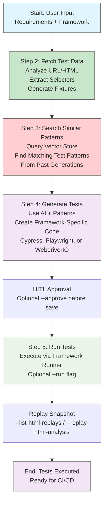
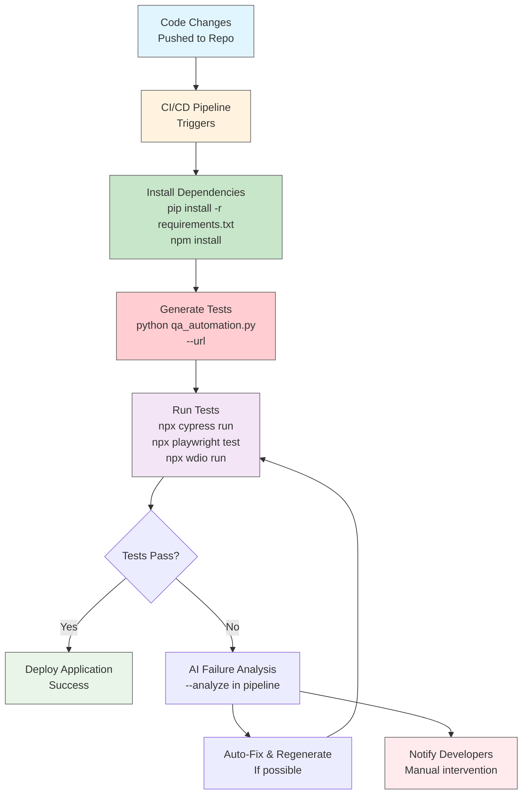

<div align="center">

# AI-Powered E2E Test Generation Platform

> *Translate natural language requirements into production-ready end-to-end tests.*

Enterprise-grade platform to generate and execute Cypress, Playwright, and WebdriverIO end-to-end tests from natural language requirements.

This project combines LLM-driven generation, LangGraph workflow orchestration, and vector-based pattern learning to improve test authoring speed while maintaining repeatability and CI/CD readiness.

[](https://github.com/aiqualitylab/ai-natural-language-tests/actions/workflows/ci.yml)
[](https://doi.org/10.5281/zenodo.19020686)


[](https://tests.aiqualitylab.org)

</div>

---

## Table of Contents

### Getting Started
- [Overview](#overview)
- [Business Value](#business-value)
- [Core Capabilities](#core-capabilities)

### Platform Design
- [Architecture](#architecture)
- [Workflow](#workflow)
- [Technology Stack](#technology-stack)

### Setup & Configuration
- [Repository Structure](#repository-structure)
- [Prerequisites](#prerequisites)
- [Installation](#installation)
- [GitHub Registry (GHCR)](#github-registry-ghcr)
- [Configuration](#configuration)

### Using the Platform
- [Usage](#usage)
- [CI/CD Integration](#cicd-integration)

### Operations
- [Security and Compliance Guidance](#security-and-compliance-guidance)
- [Troubleshooting](#troubleshooting)

### Project Info
- [Changelog](#changelog)

## Overview

The platform translates natural language requirements into executable E2E tests for:

| Framework | Output | Style |
|-----------|--------|-------|
| Cypress | `.cy.js` | Traditional & prompt-powered |
| Playwright | `.spec.ts` | TypeScript async/await |
| WebdriverIO | `.spec.js` | Mocha runner with Jest-like `expect` |

It supports both local engineering workflows and automated pipeline execution. The generator uses contextual data from live HTML analysis and historical pattern matching to produce stable, maintainable test assets.

## Business Value

> [!NOTE]
> - Reduces manual test authoring effort and onboarding time.
> - Standardizes generated test structure across teams.
> - Improves reuse through vector-based pattern memory.
> - Supports enterprise delivery with CI/CD and Docker workflows.
> - Enables faster root-cause diagnosis using AI-assisted failure analysis.

## Core Capabilities

| Capability | Detail |
|------------|--------|
| Test Generation | Natural language to executable E2E test generation |
| Orchestration | LangGraph-based multi-step orchestration |
| URL Analysis | Dynamic URL analysis and fixture generation |
| Pattern Memory | Pattern storage and semantic retrieval using FAISS + SQLite |
| LLM Support | Multi-provider: OpenAI, Anthropic, Google |
| Cypress Modes | Traditional mode and Cypress prompt-powered mode |
| Playwright | TypeScript generation |
| WebdriverIO | JavaScript `.spec.js` generation with Mocha and Chrome runner support |
| HITL | Optional human approval gate with `--approve` |
| Replay | HTML snapshot replay with `--list-html-replays` and `--replay-html-analysis` |
| Execution | Optional immediate test execution after generation |
| Tracing | OpenTelemetry trace export to Grafana Tempo |
| Logging | Optional log shipping to Grafana Loki |

## Architecture


```mermaid
graph TB
    subgraph "User Input"
        A[Natural Language<br/>Requirements]
        B[URL/HTML Data<br/>--url flag]
    C[CLI Requirement Text<br/>one or more prompts]
    end

    subgraph "AI & Workflow Engine"
        D[LangGraph Workflow<br/>5-Step Process]
        E[Multi-Provider LLM<br/>OpenAI / Anthropic / Google]
        F[Vector Store<br/>Pattern Learning<br/>FAISS + SQLite]
    end

    subgraph "Framework Generation"
        G{Cypress Framework}
        H{Playwright Framework}
        W{WebdriverIO Framework}
        I[Cypress Tests<br/>.cy.js files<br/>Traditional & cy.prompt&#40;&#41;]
        J[Playwright Tests<br/>.spec.ts files<br/>TypeScript]
        X[WebdriverIO Tests<br/>.spec.js files<br/>Mocha + expect]
    end

    subgraph "Execution & Analysis"
        K[Cypress Runner<br/>npx cypress run]
        L[Playwright Runner<br/>npx playwright test]
        M[AI Failure Analyzer<br/>--analyze flag<br/>Multi-Provider LLM]
        P[WebdriverIO Runner<br/>npx wdio run]
    end

    A --> D
    B --> D
    C --> D
    D --> E
    E --> F
    F --> D
    D --> G
    D --> H
    D --> W
    G --> I
    H --> J
    W --> X
    I --> K
    J --> L
    X --> P
    K --> M
    L --> M
    P --> M

    style D fill:#e3f2fd,color:#333333,stroke:#666666
    style E fill:#f3e5f5,color:#333333,stroke:#666666
    style F fill:#fff3e0,color:#333333,stroke:#666666
    style G fill:#c8e6c9,color:#333333,stroke:#666666
    style H fill:#ffcdd2,color:#333333,stroke:#666666
    style W fill:#ffe0b2,color:#333333,stroke:#666666
```

<details>
<summary><strong>High-Level Components</strong></summary>

- CLI entrypoint (`qa_automation.py`)
  - Parses arguments, selects mode, and orchestrates actions.
  - Calls workflow `create_workflow()` and handles result output.
- Configuration and prompts (`qa_config.py`)
  - Defines framework metadata, LLM settings, and prompt loading utilities.
  - Handles model provider fallback and YAML template parsing.
- Runtime services (`qa_runtime.py`)
  - Logging/tracing setup (OpenTelemetry, Grafana Loki) and persistent objects.
  - FAISS + SQLite pattern store lifecycle and query helpers.
  - HTML analysis replay and failure analysis formatting.
- LangGraph workflow (`qa_workflow.py`)
  - Defines `TestState` and step nodes (fetch, pattern search, generate, run).
  - Builds workflow graph with conditional transitions and checkpointer.
- Observability layer (OpenTelemetry + Loki)

</details>

## Workflow


```mermaid
flowchart TD
    A[Start: User Input<br/>Requirements + Framework] --> C[Step 2: Fetch Test Data<br/>Analyze URL/HTML<br/>Extract Selectors<br/>Generate Fixtures]
    C --> D[Step 3: Search Similar Patterns<br/>Query Vector Store<br/>Find Matching Test Patterns<br/>From Past Generations]
    D --> E[Step 4: Generate Tests<br/>Use AI + Patterns<br/>Create Framework-Specific Code<br/>Cypress, Playwright, or WebdriverIO]
    E --> H[HITL Approval<br/>Optional --approve before save]
    H --> F[Step 5: Run Tests<br/>Execute via Framework Runner<br/>Optional --run flag]
    F --> R[Replay Snapshot<br/>--list-html-replays / --replay-html-analysis]
    R --> G[End: Tests Executed<br/>Ready for CI/CD]

    style A fill:#e1f5fe,color:#333333,stroke:#666666
    style C fill:#c8e6c9,color:#333333,stroke:#666666
    style D fill:#ffcdd2,color:#333333,stroke:#666666
    style E fill:#f3e5f5,color:#333333,stroke:#666666
    style F fill:#e8f5e8,color:#333333,stroke:#666666
    style G fill:#f3e5f5,color:#333333,stroke:#666666
```

Generation follows a deterministic five-step flow:

| Step | Name | Description |
|------|------|-------------|
| 2 | Fetch Test Data | Analyze URL/HTML, extract selectors, generate fixtures |
| 3 | Search Similar Patterns | Query vector store for matching historical patterns |
| 4 | Generate Tests | Use AI + patterns to create framework-specific code, optionally HITL-gated via `--approve` |
| 5 | Run Tests | Optionally execute via framework runner (`--run`) |
| Replay | Debug HTML Analysis | Replay stored HTML snapshots via CLI (`--list-html-replays`, `--replay-html-analysis`) |

## Technology Stack

| Layer | Technology |
|-------|------------|
| Orchestration | Python CLI orchestration |
| Workflow | LangChain + LangGraph |
| Vector Store | FAISS + SQLite |
| LLM Backends | OpenAI / Anthropic / Google |
| Test Runners | Cypress, Playwright, and WebdriverIO runners |
| Observability | OpenTelemetry SDK and OTLP exporter |
| Logging | Loki logging handler (optional) |

## Repository Structure

<details>
<summary>View repository tree</summary>

```text
ai-natural-language-tests/
|-- cypress/
|   |-- e2e/
|   |   |-- generated/
|   |   `-- prompt-powered/
|   `-- fixtures/
|-- tests/
|   `-- generated/
|-- webdriverio/
|   `-- tests/
|       `-- generated/
|-- prompt_specs/
|-- vector_db/
|-- qa_automation.py
|-- qa_config.py
|-- qa_runtime.py
|-- qa_workflow.py
|-- cypress.config.js
|-- playwright.config.ts
|-- wdio.conf.js
|-- package.json
|-- requirements.txt
|-- Dockerfile
|-- docker-compose.yml
`-- README.md
```

</details>

## Prerequisites

| Requirement | Version / Notes |
|-------------|------------------|
| Python | 3.10+ |
| Node.js | 22+ |
| npm | Current stable release |
| Git | Current stable release |
| Playwright browsers | `npx playwright install chromium` |

## Installation

<details>
<summary><strong>Local Setup</strong></summary>

```bash
git clone https://github.com/aiqualitylab/ai-natural-language-tests.git
cd ai-natural-language-tests
python -m venv .venv
# Windows PowerShell: .\.venv\Scripts\Activate.ps1
# macOS/Linux: source .venv/bin/activate
pip install -r requirements.txt
npm ci
npx playwright install chromium
```

Create `.env` from `.env.example`, then set at least one provider key:

```bash
OPENAI_API_KEY=your_key
```

</details>

### Optional: GitAgent (Repo-Specific)

This repository includes a targeted gitagent setup for its QA automation workflow:

- `agent.yaml` (manifest)
- `SOUL.md` and `RULES.md` (behavior and constraints)
- `knowledge/` (framework and repo references)

In short: `agent.yaml` defines the repo agent, `SOUL.md` and `RULES.md` define how it should behave, and `knowledge/` gives it project-specific framework guidance.

Quick commands:

```bash
npm run gitagent:validate
npm run gitagent:info
npm run gitagent:export
```

<details>
<summary><strong>Docker Setup</strong></summary>

```bash
git clone https://github.com/aiqualitylab/ai-natural-language-tests.git
cd ai-natural-language-tests
docker compose build
```

Docker Compose loads `.env` and now explicitly forwards observability variables for Tempo and Loki to the container runtime.

Run in container:

```bash
docker compose run --rm test-generator "Test login" --url https://the-internet.herokuapp.com/login
```

Run with observability enabled:

```bash
docker compose run --rm test-generator \
  "Test login" --url https://the-internet.herokuapp.com/login --framework playwright --run
```

</details>

## GitHub Registry (GHCR)

Pre-built Docker images are published to GitHub Container Registry. No local clone or build required.

| Without GHCR | With GHCR |
|---|---|
| Clone → install → build → run | `docker run` — done |
| Each user builds their own image | One image built once, shared everywhere |
| "Works on my machine" problems | Identical environment for every user |

### Pull and run

```bash
docker pull ghcr.io/aiqualitylab/ai-natural-language-tests:latest

docker run --rm \
  -e OPENAI_API_KEY=your_key \
  ghcr.io/aiqualitylab/ai-natural-language-tests:latest \
  "Test login" --url https://the-internet.herokuapp.com/login
```

### Image tags

| Tag | Use case |
|-----|----------|
| `latest` | Always the most recently published version — use for quick runs |
| `v4.1.0` | Pinned to a specific release — use in CI/CD for reproducibility |

For publishing and release management, see [CONTRIBUTING.md](CONTRIBUTING.md).

## Configuration

<details>
<summary><strong>Core API Keys</strong></summary>

```bash
OPENAI_API_KEY=your_key
ANTHROPIC_API_KEY=your_key
GOOGLE_API_KEY=your_key
```

</details>

<details>
<summary><strong>OpenTelemetry (Grafana Tempo)</strong></summary>

```bash
OTEL_PROVIDER=grafana
OTEL_EXPORTER_OTLP_ENDPOINT=https://otlp-gateway-prod-eu-north-0.grafana.net/otlp
OTEL_EXPORTER_OTLP_HEADERS=Authorization=Basic <base64(instance_id:api_token)>
```

</details>

<details>
<summary><strong>Loki Logging (Optional)</strong></summary>

```bash
GRAFANA_LOKI_URL=https://logs-prod-eu-north-0.grafana.net
GRAFANA_INSTANCE_ID=<instance_id>
GRAFANA_API_TOKEN=<logs_write_token>
```

</details>

## Usage

**Quick Reference**

| Mode | Command |
|------|---------|
| Cypress (default) | `python qa_automation.py "requirement" --url <url>` |
| Playwright | `python qa_automation.py "requirement" --url <url> --framework playwright` |
| WebdriverIO | `python qa_automation.py "requirement" --url <url> --framework webdriverio` |
| Prompt-powered Cypress | `python qa_automation.py "requirement" --url <url> --use-prompt` |
| Generate + Execute | `python qa_automation.py "requirement" --url <url> --run` |
| Failure Analysis | `python qa_automation.py --analyze "error message"` |
| Pattern Inventory | `python qa_automation.py --list-patterns` |

> [!NOTE]
> The current CLI supports URL-driven generation via `--url`. A direct `--data` JSON input flag is not implemented in this repository yet.

**Natural Language Prompt Examples**

| What you type | What AI generates |
|---------------|-------------------|
| `"Test login with valid credentials"` | Login form fill + submit + success assertion |
| `"Test login fails with wrong password"` | Negative test with error message assertion |
| `"Test contact form submission"` | Form field detection + submit + confirmation |
| `"Test search returns results"` | Search input + trigger + results count assertion |
| `"Test signup with missing fields"` | Validation error coverage for required fields |
| `"Test logout clears session"` | Post-login logout + redirect assertion |

> [!TIP]
> **Writing effective AI requirements**
>
> - Be specific about the action: *"Test login"* vs *"Test login with valid credentials and verify dashboard loads"*
> - Mention the expected outcome when it matters: *"...and verify error message appears"*
> - Use `--url` to give the AI real page context — it reads the HTML and picks the right selectors automatically
> - Chain multiple requirements in one run: `"Test login" "Test logout" --url <url>`

### Generate Cypress Test

<details>
<summary>Show command</summary>

```bash
python qa_automation.py "Test login" --url https://the-internet.herokuapp.com/login
```

</details>

### Generate Playwright Test

<details>
<summary>Show command</summary>

```bash
python qa_automation.py "Test login" --url https://the-internet.herokuapp.com/login --framework playwright
```

</details>

### Generate WebdriverIO Test

<details>
<summary>Show command</summary>

```bash
python qa_automation.py "Test login" --url https://the-internet.herokuapp.com/login --framework webdriverio
```

</details>

### Prompt-Powered Cypress Mode

<details>
<summary>Show command</summary>

```bash
python qa_automation.py "Test login" --url https://the-internet.herokuapp.com/login --use-prompt
```

</details>

### Generate and Execute

<details>
<summary>Show command</summary>

```bash
python qa_automation.py "Test login" --url https://the-internet.herokuapp.com/login --framework playwright --run
```

</details>

### Failure Analysis

<details>
<summary>Show commands</summary>

```bash
python qa_automation.py --analyze "CypressError: Element not found"
python qa_automation.py --analyze -f error.log
```

</details>

> [!NOTE]
> The AI failure analyzer returns a structured diagnosis:
>
> | Field | Description |
> |-------|-------------|
> | `CATEGORY` | Error type: `SELECTOR`, `TIMEOUT`, `ASSERTION`, `NETWORK`, etc. |
> | `REASON` | Root cause explanation in plain English |
> | `FIX` | Suggested code change or configuration fix |

### Pattern Inventory

<details>
<summary>Show command</summary>

```bash
python qa_automation.py --list-patterns
```

</details>

## CI/CD Integration


```mermaid
flowchart TD
    A[Code Changes<br/>Pushed to Repo] --> B[CI/CD Pipeline<br/>Triggers]
    B --> C[Install Dependencies<br/>pip install -r requirements.txt<br/>npm install]
    C --> D[Generate Tests<br/>python qa_automation.py<br/>--url]
    D --> E[Run Tests<br/>npx cypress run<br/>npx playwright test<br/>npx wdio run]
    E --> F{Tests Pass?}
    F -->|Yes| G[Deploy Application<br/>Success]
    F -->|No| H[AI Failure Analysis<br/>--analyze in pipeline]
    H --> I[Auto-Fix & Regenerate<br/>If possible]
    I --> E
    H --> J[Notify Developers<br/>Manual intervention]

    style A fill:#e1f5fe,color:#333333,stroke:#666666
    style B fill:#fff3e0,color:#333333,stroke:#666666
    style C fill:#c8e6c9,color:#333333,stroke:#666666
    style D fill:#ffcdd2,color:#333333,stroke:#666666
    style E fill:#f3e5f5,color:#333333,stroke:#666666
    style G fill:#e8f5e8,color:#333333,stroke:#666666
    style J fill:#ffebee,color:#333333,stroke:#666666
```

Recommended pipeline stages:

| Stage | Action |
|-------|--------|
| 1 | Install Python and Node dependencies |
| 2 | Validate environment variables and secrets injection |
| 3 | Generate tests from requirements |
| 4 | Execute generated tests |
| 5 | Publish artifacts and reports |
| 6 | Export telemetry to observability stack |

## Security and Compliance Guidance

> [!IMPORTANT]
> - Store secrets only in secure secret managers (never commit `.env`).
> - Use scoped API tokens with least-privilege access.
> - Rotate provider keys and Grafana tokens on a fixed cadence.
> - Keep generated tests and reports free of sensitive production data.
> - Apply repository protection rules and mandatory CI checks.

## Troubleshooting

> [!WARNING]
> **Traces Not Visible in Grafana Tempo**
>
> - Verify OTLP endpoint region and datasource selection.
> - Verify `Authorization=Basic <base64(instance_id:api_token)>` format.
> - Query with:
>
> ```traceql
> {resource.service.name="ai-natural-language-tests"}
> ```

> [!NOTE]
> **Loki Authentication Errors**
>
> - Ensure token has `logs:write` scope.
> - Confirm instance ID and logs endpoint match the same Grafana stack.

> [!TIP]
> **Docker Observability Validation**
>
> - Confirm `.env` includes OTLP and Loki keys before `docker compose run`.
> - Use `docker compose config` to verify environment interpolation.
> - In Grafana Explore, query Tempo with `service.name="ai-natural-language-tests"`.
> - In Grafana Loki, query labels: `{service_name="ai-natural-language-tests"}`.

> [!TIP]
> **Switching to Headed Mode for Debugging**
>
> Tests run headless by default. To debug interactively, switch your framework config:
>
> **Cypress:**
> - Edit `cypress.config.js` and add `headed: true` after `browser: 'chrome'`
> - Or run: `npx cypress run --headed --spec 'cypress/e2e/generated/*.cy.js'`
>
> **Playwright:**
> - Edit `playwright.config.ts` and change `headless: true` → `headless: false`
> - Or run: `npx playwright test --headed tests/generated/`
>
> **WebdriverIO:**
> - Edit `wdio.conf.js` and comment out `'--headless=new'` from the args array
>
> **Docker Headed Mode (with X11 forwarding):**
> ```bash
> docker build --target debug -t ai-tests:debug .
> docker run -e DISPLAY=$DISPLAY -v /tmp/.X11-unix:/tmp/.X11-unix ai-tests:debug
> ```
> - Optional: mainly for Linux visual debugging.

> - Retry with generated single-spec command from logs.

## Changelog

Release notes are maintained in [`CHANGELOG.md`](CHANGELOG.md) using a standard Keep a Changelog format.

---

*Production-focused AI-assisted E2E test generation for modern QA teams.*

<table width="100%"><tr>
<td><em>© 2026 AI Quality Lab / <a href="https://www.linkedin.com/in/sreekanthharigovindan/">Sreekanth Harigovindan.</a></em></td>
<td width="1" align="right" nowrap><a href="https://tests.aiqualitylab.org"></a><br/><sub><a href="https://tests.aiqualitylab.org">tests.aiqualitylab.org</a></sub></td>
</tr></table>

---
Documentation licensed under CC BY 4.0.
